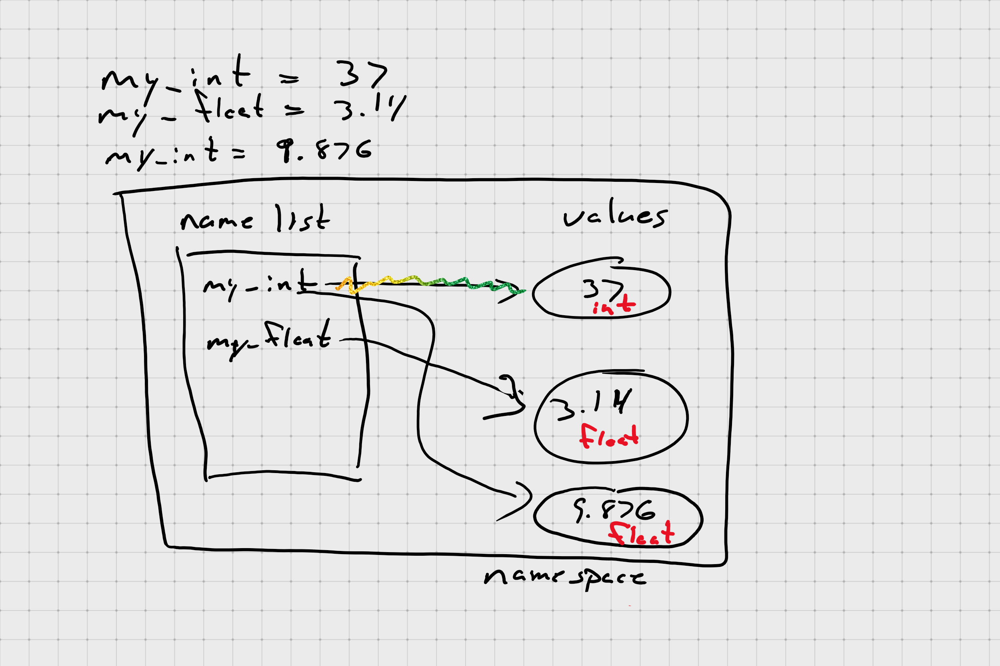

# Lecture Notes for Chapter 1

## Rules

1. Think before you program!
1. A program is a _human-readable_ essay on problem solving that also happens to run on a computer.
1. The best way to improve your programming and problem solving skill is to practice!

## Parts of a Program

### Statements and Expressions

**Statement:** Do not return a value but do perform some work, possibly resulting in a _side effect_

my_int = 37
answer = 42

**Expression:** Any combination of values and operands that _return a value_

my_int + 5
37 + 5

### Keywords

special, reserved words in the language

### Operators

tokens that have meaning to Python

(arithmetic and logical)

- - - ** / // %
      << >> & | ^ ~
      < > <= >= == != <>
      += -= \*= /= //= %=
      &= |= ^= >>= <<= **=

### Punctuators and Delimiters

separate elements in Python statements and expressions

( ) [ ] { }
. : . = ;
' " # \ @

### Literals

fixed values that appear in statements and expressions

```python
my_int = 37
```

The **37** is a numeric literal

```python
name = "Joe"
```

**Joe** is a string literal

### Syntax rules

rules for forming expressions and statements using the parts of the language listed above

## Variable

A variable is anything that can be assigned a value

Identifier that _you_ create

### Variable creation and assignment

```python
my_int = 37
my_float = 3.14
```



## Objects and Types

A Python _object_ is a "thing" that has

- an _identity_ (a unique identifier for the object)
- some _attributes_ (the properties of the object, including its type)
- zero or more names

### Numbers

integers or floats

42 # int
42.0 # float (identifiers)

**objects have type, variables (identifiers) do not**
