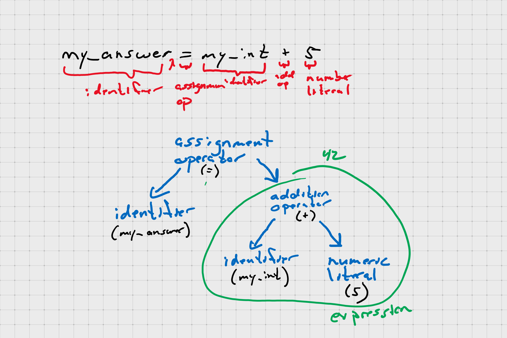
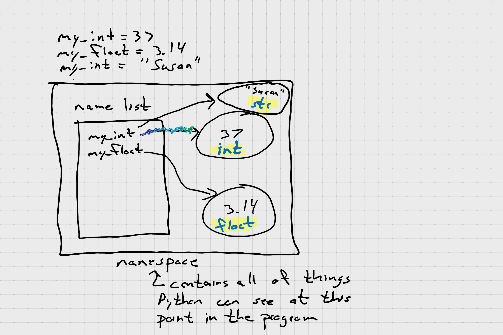

# Lecture Notes for Chapter 1

## Rules

1. Think before you program!
1. A program is a _human-readable_ essay on problem solving that just happens to run on a computer.
1. The best way to improve your programming and problem-solving skills is to practice!
1. A foolish consistency is the hobgoblin of little minds.

## Parts of a Program

### Modules

- a *module* is a file that contains Python code
- a module can be imported into other Python modules (to make that code available)
- usage:
  ```python
  import module  # load the entire contents of the module
  from module import identifier(s)
  ```

### Statements and Expressions

**Expression:** combination of values and operations that *return a value*

**Statement:** do not return a value, but their evaluation may produce a *side effect*

```python
>>> my_int = 37  # statement WITH a side effect
>>> my_int  # an expression
37
>>> my_answer = my_int + 5  # an statement that CONTAINS an expression
```



### Comments

Both code comments using `#`

And documentation using `docstrings` (`"""`)

[PEP257](https://www.python.org/dev/peps/pep-0257/)

Docstrings are for writing documentation about our modules, functions, classes, etc.

Comments are for clarifying a line or a few lines of code

### Tokens (Special Elements)

#### Keywords

Special words reserved for Python

- False
- None
- True
- and
- as
- assert
- async
- await
- break
- class
- continue
- def
- del
- elif
- else
- except
- finally
- for
- from
- global
- if
- import
- in
- is
- lambda
- nonlocal
- not
- or
- pass
- raise
- return
- try
- while
- with
- yield

#### Operators

Special tokens that have meaning to the Python interpreter

```text
+  -  *  **  /  //  %
<<  >>  &  |  ^  ~
<  >  <=  >=  ==  !=  <>
+=  -=  *=  /=  //=  %=
&=  |=  *=  >>=  <<=  **=
```

##### Augmented Assignment Operators

```python
# these two lines of code produce the same result
my_int = my_int + 5
my_int += 5
```

#### Punctators and Delimiters

Separate different elements in Python expressions and statements

 ```text
 (  )  [  ]  {  }
 ,  :  .  `  =  ;
 '  "  #  \  @
 ```

#### Literals

 A *literal* is a value that appears in a statement or expression

 ```python
 the_answer = 42  # 42 is a numeric literal
 name = "Joe"  # Joe is a string literal
 ```

### Naming things in Python

[PEP8](https://pep8.org/)

## Variables

A *variable* is name that you choose which represents a value that can be changed.

```python
my_int = 37
my_float = 3.14
```


```python
my_int = 37
my_float = 3.14
my_ing = "Susan"
```



**Note:** variables in Python *do not* have type, but objects do.

## Objects and Type

In Python, every "thing" in an object.

Python objects have:

- an *identity* (`id()`) - unique identifer for that object
- some *attributes* - properties that describe the object
- zero or more names
