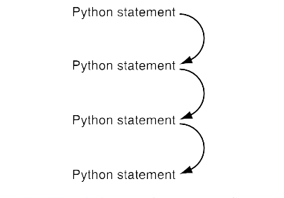
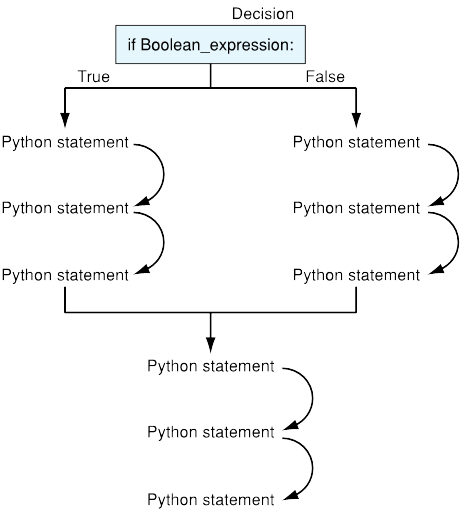
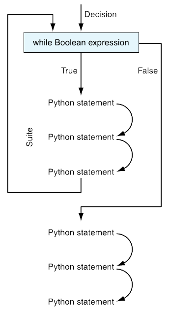
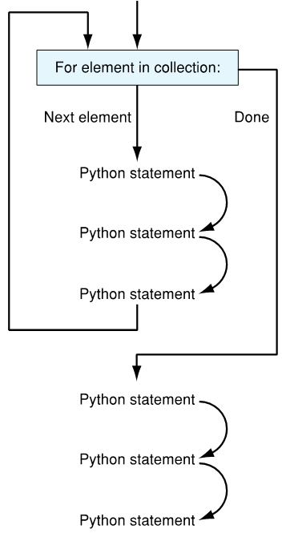
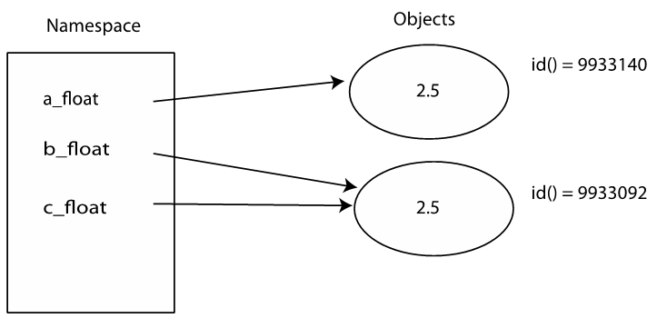

# Lecture Notes for Chapter 2

## Rules

1. Think before you program!
1. A program is a _human-readable_ essay on problem solving that also happens to run on a computer.
1. The best way to improve your programming and problem solving skill is to practice!
1. A foolish consistency is the hobgoblin of little minds.
1. Test your code, often and thoroughly!

## Control

> If you come to a fork in the road, take it. &mdash; Yogi Berra

### Selection

Generally, your code runs sequentially.



However, we are able to change that order of execution using _decision_ and/or _repetition_ structures



### Booleans for Decisions

operator | meaning
-------- | -------
< | less than
\> | greater than
<= | less than or equal to
\>= | greater than or equal to
== | equal to
!= | not equal to

### The `if` Statement

Python's `if` statement allows for conditional execution of code.

```python
if boolean_expression:
    # this suite executes if the boolean expression evaluated to True
```

### The `else` Statement

Python's `else` statement allows for choosing between two possible paths of execution in our code.

```python
if boolean_expression:
    # this suite executes if the boolean expression evaluates to True
else:
    # this suite executes if the boolean expression evaluates to False
```

### The `elif` Statement

Python's `elif` (else-if) statement allows for choosing one of multiple paths of execution in our code.

```python
if boolean_expression:  # boolean expression 1
    # this suite executes only if boolean expression 1 evaluates to True
elif boolean_expression:  # boolean expression 2
    # this suite executes only if boolean expression 1 evaluates to
    # False and boolean expression 2 evaluates to True
elif boolean_expression:  # boolean expression 3
    # this suite executes only if both boolean expressions 1 and 2 above
    # evaluate to False and boolean expression 3 evaluates to True
else:
    # this suite executes only if boolean expressions 1, 2, and 3 above
    # all evaluates to False; it is run unconditionally
```

### Example: What is a Safe Lead in Basketball?

Algorithm by [Bill James](https://www.basketballcoachweekly.net/basketball-coaching/in-game-strategy/bill-jamess-safe-lead-formula/)

1. Take the number of points one team is ahead
1. Subtract three
1. Add ½ point if team that is ahead has the ball, subtract ½ point otherwise
1. Square the result
1. If the result is greater than the number of seconds left, the lead is safe

`code_listing_2.7`

### Repetition

Besides selecting which statements to execute, a fundamental need in a program is repetition, or _iteration_.

#### `while` Statements

The `while` statement allows for repeating one or more statements or expressions while its boolean expression is True.



```python
while boolean_expression:
    # this suite will execute repeatedly as long as the boolean
    # expression above holds True
```

`code_listing_while`

### `for` Statements

Python's `for` statement is used to execute a suite for every element in a collection.



```python
for element in collection:
    # this suite will execute for every element in the collection
```

`code_listing_for_1`

`code_listing_for_2`

#### Perfect Numbers

A _perfect number_ is an integer whose integer divisors (excluding the number itself) sum up to the number. For example,

```text
   6 = 1 + 2 + 3
  28 = 1 + 2 + 4 + 7 + 14
 496 = 1 + 2 + 4 + 8 + 16 + 31 + 62+ 124 + 248
8128 = 1 + 2 + 4 + 8 + 16 + 32 + 64+ 127 + 254 +
       508 + 1016 + 2032 + 4064
```

`code_listing_perfect_numbers`

## In-Depth Control

### Relational Operators

- `3 > 2` ➡️ `True`
- Relational Operators have low precedence
  - `5 + 3 < 3 – 2`
  - `8 < 1` ➡️ `False`
- Can only compare like types
  - `'1' < 2` ➡️ Error
  - `int('1') < 2` ➡️ `True`

### Equality vs Identity

```python
a_float = 2.5
b_float = 2.5
c_float = b_float
```



### Another Word on Assignment

Python has an elegant syntax for multiple assignment.

```python
a, b, c = 15, 10 , 17
```

#### More On `while` Loop Control and Initialization

Initialization
: The loop-control variable needs to be initialized before the loop is entered

Control
: The condition statement of the `while` loop needs to be written, and the Boolean expression is written in terms of the loop-control variable. The initial value and this condition are usually related and should be considered together.

Modification
: Somewhere in the `while` loop suite the loop-control variable is modified so that eventually the Boolean expression of the `while` loop becomes `False`. This often means the loop-control variable will have a different value during every iteration of the loop.

#### `break` Statement

The `break` statement will cause the loop suite to be exited immediately. There will be no further execution of the suite and the program will continue with the _first statement following the loop_.

#### `continue` Statement

The `continue` statement will cause the current iteration of the loop to end immediately, execution will start again at the _beginning_ of the loop's suite.

#### Sentinel Loops

A _sentinel loop_ is a loop that is controlled by a sentinel &mdash; a guard value &mdash; which is a value used to terminate the loop.

```python
value = some_value
while value != sentinel_value:
    # process value
    # modify value
```

## Plotting Data with Pylab

`code_listing_2.27`

`code_listing_2.28`
