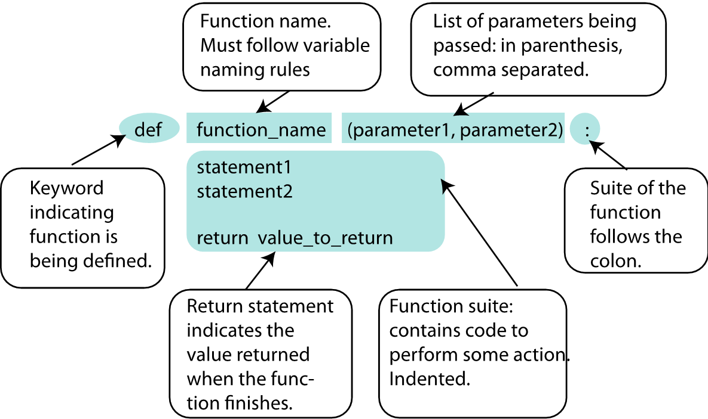
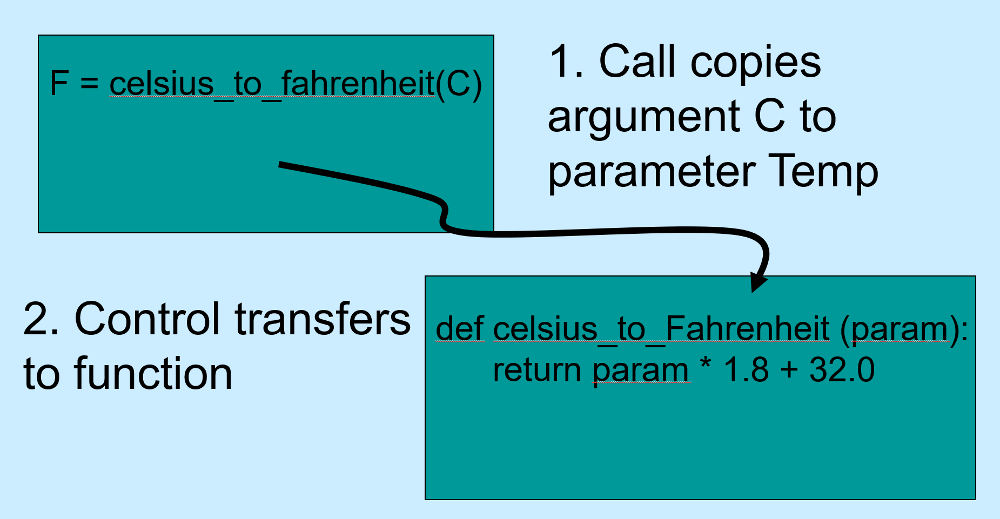
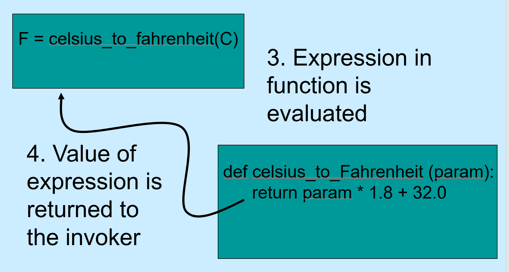
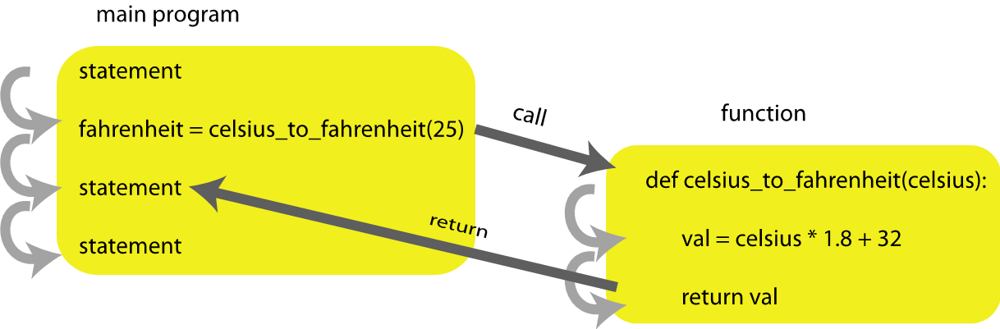

# Python Functions

## Why?

- Divide-and-Conquer Problem Solving
- Abstraction
- Reuse
- Sharing
- Security
- Simplification and Readability
- Debugging

## Python Functions



### Arguments and Parameters

These are often used as synonyms, however, there is a formal definition that you should be aware of:

An **actual** parameter is one that gets passed into a function.

A **formal** paramater is the one named in the function header.

```python
def is_all_digits(s):  # s is a formal paramter
    digits = ['0','1','2','3','4','5','6','7','8','9']

    for character in s:
        if character not in digits:
            return False

    return True

my_string = "1a2b3c"

is_all_digits(my_string)  # my_sting is an actual parameter
```

```python
def divide_numbers(numerator, denominator):  # numerator and denominator are formal parameters
    return numerator / denominator  # return 37 / 42

a = 37
b = 42

dividend = divide_numbers(a, b)  # actual parameter a gets mapped to formal parameter numerator
                                 # actual parameter b gets mapped to formal parameter denominator
```

## Flow of Control

```python
def celsius_to_fahrenheit(c):
    return c * 1.8  + 32
```






Functions can call functions (can call functions, ad infinitum)

### Parameter Passing

Generally passed in order.

Named parameters are also possible, as are default values.

### Return Values

`return`

What if there is no `return` statement? &ndash; The function returns the special value `None`

What if there are multiple `return` statements?

## When to Use Functions

No hard and fast rules but...

- Do one thing
- Be readable
- Not too long
- Reusable
- Complete
- Refactoring
