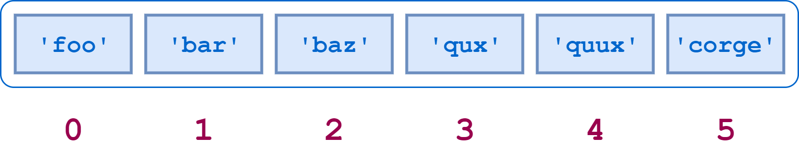
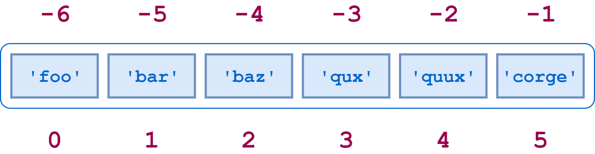
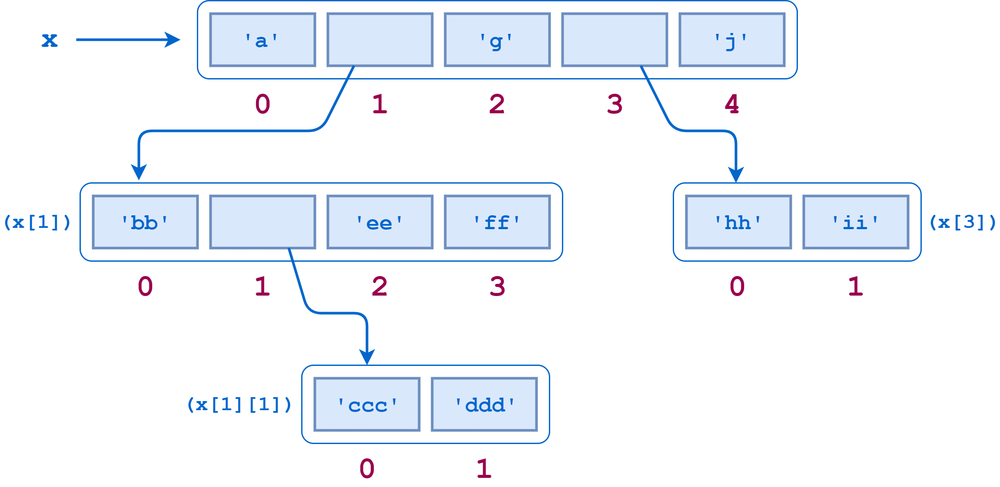

# Python Lists

Python's _list_ is a collection type; it's a single _identifier_ that refers to _multiple_ data objects.

Like strings, it is also a sequence and iterable. This means it can be indexed, sliced, and iterated over.

- Lists are ordered
- Lists can contain any arbitrary objects
- List elements can be accessed by index
- Lists can be nested to arbitrary depth
- Lists are mutable
- Lists are dynamic

## Lists Are Ordered

A list is not merely a collection of objects, ut is an _ordered_ collection of objects.

The order in which you specify the elements when you define a list is an innate characteristic of that list and is maintained for that list’s lifetime.

```python
>>> a = ['foo', 'bar', 'baz', 'qux']
>>> b = ['baz', 'qux', 'bar', 'foo']
>>> a == b
False
>>> a is b
False

>>> [1, 2, 3, 4] == [4, 1, 3, 2]
False
```

## Lists Can Contain Any Arbitrary Objects

A list can contain any assortment of objects. The elements of a list can all be the same type:

```python
>>> a = [2, 4, 6, 8]
>>> a
[2, 4, 6, 8]
```

Or the elements can be of varying types:

```python
>>> a = [21.42, 'foobar', 3, 4, 'bark', False, 3.14159]
>>> a
[21.42, 'foobar', 3, 4, 'bark', False, 3.14159]
```

Lists can even contain complex objects, like functions, classes, and modules:

```python
>>> int
<class 'int'>
>>> len
<built-in function len>
>>> def foo():
...     pass
...
>>> foo
<function foo at 0x035B9030>
>>> import math
>>> math
<module 'math' (built-in)>

>>> a = [int, len, foo, math]
>>> a
[<class 'int'>, <built-in function len>, <function foo at 0x02CA2618>,
<module 'math' (built-in)>]
```

A list can contain any number of objects, from zero to as many as your computer’s memory will allow:

```python
>>> a = []
>>> a
[]

>>> a = [ 'foo' ]
>>> a
['foo']

>>> a = [0, 1, 2, 3, 4, 5, 6, 7, 8, 9, 10, 11, 12, 13, 14, 15, 16, 17, 18, 19, 20,
... 21, 22, 23, 24, 25, 26, 27, 28, 29, 30, 31, 32, 33, 34, 35, 36, 37, 38, 39, 40,
... 41, 42, 43, 44, 45, 46, 47, 48, 49, 50, 51, 52, 53, 54, 55, 56, 57, 58, 59, 60,
... 61, 62, 63, 64, 65, 66, 67, 68, 69, 70, 71, 72, 73, 74, 75, 76, 77, 78, 79, 80,
... 81, 82, 83, 84, 85, 86, 87, 88, 89, 90, 91, 92, 93, 94, 95, 96, 97, 98, 99, 100]
>>> a
[0, 1, 2, 3, 4, 5, 6, 7, 8, 9, 10, 11, 12, 13, 14, 15, 16, 17, 18, 19, 20,
21, 22, 23, 24, 25, 26, 27, 28, 29, 30, 31, 32, 33, 34, 35, 36, 37, 38, 39,
40, 41, 42, 43, 44, 45, 46, 47, 48, 49, 50, 51, 52, 53, 54, 55, 56, 57, 58,
59, 60, 61, 62, 63, 64, 65, 66, 67, 68, 69, 70, 71, 72, 73, 74, 75, 76, 77,
78, 79, 80, 81, 82, 83, 84, 85, 86, 87, 88, 89, 90, 91, 92, 93, 94, 95, 96,
97, 98, 99, 100]
```

(A list with a single object is sometimes referred to as a singleton list.)

List objects needn’t be unique. A given object can appear in a list multiple times:

```python
>>> a = ['bark', 'meow', 'woof', 'bark', 'cheep', 'bark']
>>> a
['bark', 'meow', 'woof', 'bark', 'cheep', 'bark']
```

## List Elements Can Be Accessed By Index

Individual elements in a list can be accessed using an index in square brackets.

This is just like accessing individual characters in a string.

Like strings, list indexing is zero-based.

```python
>>> a = ['foo', 'bar', 'baz', 'qux', 'quux', 'corge']
```


Here is Python code to access some elements of a:

```python
>>> a[0]
'foo'
>>> a[2]
'baz'
>>> a[5]
'corge'
```

Virtually everything about string indexing works similarly for lists.

For example, a negative list index counts from the end of the list:



```python
>>> a[-1]
'corge'
>>> a[-2]
'quux'
>>> a[-5]
'bar'
```

Slicing also works. If a is a list, the expression `a[m:n]` returns the portion of `a` from index `m` up to, but not including, index `n`:

```python
>>> a = ['foo', 'bar', 'baz', 'qux', 'quux', 'corge']

>>> a[2:5]
['baz', 'qux', 'quux']
```

Other features of string slicing work analogously for list slicing as well:

- Both positive and negative indices can be specified:

    ```python
    >>> a[-5:-2]
    ['bar', 'baz', 'qux']
    >>> a[1:4]
    ['bar', 'baz', 'qux']
    >>> a[-5:-2] == a[1:4]
    True
    ```
- Omitting the first index starts the slice at the beginning of the list, and omitting the second index extends the slice to the end of the list:

    ```python
    >>> print(a[:4], a[0:4])
    ['foo', 'bar', 'baz', 'qux'] ['foo', 'bar', 'baz', 'qux']
    >>> print(a[2:], a[2:len(a)])
    ['baz', 'qux', 'quux', 'corge'] ['baz', 'qux', 'quux', 'corge']

    >>> a[:4] + a[4:]
    ['foo', 'bar', 'baz', 'qux', 'quux', 'corge']
    >>> a[:4] + a[4:] == a
    True
    ```

- You can specify a stride—either positive or negative:

    ```python
    >>> a[0:6:2]
    ['foo', 'baz', 'quux']
    >>> a[1:6:2]
    ['bar', 'qux', 'corge']
    >>> a[6:0:-2]
    ['corge', 'qux', 'bar']
    ```

- The syntax for reversing a list works the same way it does for strings:

    ```python
    >>> a[::-1]
    ['corge', 'quux', 'qux', 'baz', 'bar', 'foo']
    ```

- The `[:]` syntax works for lists. However, there is an important difference between how this operation works with a list and how it works with a string.

    If `s` is a string, `s[:]` returns a _reference_ to the same object:

    ```python
    >>> s = 'foobar'
    >>> s[:]
    'foobar'
    >>> s[:] is s
    True
    ```

    If `a` is a list, `a[:]` returns a _new object_ that is a _copy_ of `a`:

    ```python
    >>> a = ['foo', 'bar', 'baz', 'qux', 'quux', 'corge']
    >>> a[:]
    ['foo', 'bar', 'baz', 'qux', 'quux', 'corge']
    >>> a[:] is a
    False
    ```

Several Python operators and built-in functions can also be used with lists in ways that are analogous to strings:

- The `in` and `not in` operators:

    ```python
    >>> a
    ['foo', 'bar', 'baz', 'qux', 'quux', 'corge']

    >>> 'qux' in a
    True
    >>> 'thud' not in a
    True
    ```

- The concatenation (`+`) and replication (`*`) operators:

    ```python
    >>> a
    ['foo', 'bar', 'baz', 'qux', 'quux', 'corge']

    >>> a + ['grault', 'garply']
    ['foo', 'bar', 'baz', 'qux', 'quux', 'corge', 'grault', 'garply']
    >>> a * 2
    ['foo', 'bar', 'baz', 'qux', 'quux', 'corge', 'foo', 'bar', 'baz',
    'qux', 'quux', 'corge']
    ```

- The `len()`, `min()`, and `max()` functions:

    ```python
    >>> a
    ['foo', 'bar', 'baz', 'qux', 'quux', 'corge']

    >>> len(a)
    6
    >>> min(a)
    'bar'
    >>> max(a)
    'qux'
    ```

It’s not an accident that strings and lists behave so similarly. They are both special cases of a more general object type called an _iterable_.

In each example above, the list is always assigned to a variable before an operation is performed on it.

But you can operate on a list literal as well:

```python
>>> ['foo', 'bar', 'baz', 'qux', 'quux', 'corge'][2]
'baz'

>>> ['foo', 'bar', 'baz', 'qux', 'quux', 'corge'][::-1]
['corge', 'quux', 'qux', 'baz', 'bar', 'foo']

>>> 'quux' in ['foo', 'bar', 'baz', 'qux', 'quux', 'corge']
True

>>> ['foo', 'bar', 'baz'] + ['qux', 'quux', 'corge']
['foo', 'bar', 'baz', 'qux', 'quux', 'corge']

>>> len(['foo', 'bar', 'baz', 'qux', 'quux', 'corge'][::-1])
6
```python

For that matter, you can do likewise with a string literal:

```python
>>> 'If Comrade Napoleon says it, it must be right.'[::-1]
'.thgir eb tsum ti ,ti syas noelopaN edarmoC fI'
```

## Lists Can Be Nested to Arbitrary Depth

You have seen that an element in a list can be any sort of object. That includes another list. A list can contain sublists, which in turn can contain sublists themselves, and so on to arbitrary depth.

Consider this (admittedly contrived) example:

```python
>>> x = ['a', ['bb', ['ccc', 'ddd'], 'ee', 'ff'], 'g', ['hh', 'ii'], 'j']
>>> x
['a', ['bb', ['ccc', 'ddd'], 'ee', 'ff'], 'g', ['hh', 'ii'], 'j']
```



`x[0]`, `x[2]`, and `x[4]` are strings, each one character long:

```python
>>> print(x[0], x[2], x[4])
a g j
```

But `x[1]` and `x[3]` are sublists:

```python
>>> x[1]
['bb', ['ccc', 'ddd'], 'ee', 'ff']

>>> x[3]
['hh', 'ii']
```

To access the items in a sublist, simply append an additional index:

```python
>>> x[1]
['bb', ['ccc', 'ddd'], 'ee', 'ff']

>>> x[1][0]
'bb'
>>> x[1][1]
['ccc', 'ddd']
>>> x[1][2]
'ee'
>>> x[1][3]
'ff'

>>> x[3]
['hh', 'ii']
>>> print(x[3][0], x[3][1])
hh ii
```

`x[1][1]` is yet _another_ sublist, so adding one more index accesses its elements:

```python
>>> x[1][1]
['ccc', 'ddd']
>>> print(x[1][1][0], x[1][1][1])
ccc ddd
```

There is no limit, short of the extent of your computer’s memory, to the depth or complexity with which lists can be nested in this way.

All the usual syntax regarding indices and slicing applies to sublists as well:

```python
>>> x[1][1][-1]
'ddd'
>>> x[1][1:3]
[['ccc', 'ddd'], 'ee']
>>> x[3][::-1]
['ii', 'hh']
```

However, be aware that operators and functions apply to only the list at the level you specify and are not recursive. Consider what happens when you query the length of `x` using `len()`:

```python
>>> x
['a', ['bb', ['ccc', 'ddd'], 'ee', 'ff'], 'g', ['hh', 'ii'], 'j']
>>> len(x)
5

>>> x[0]
'a'
>>> x[1]
['bb', ['ccc', 'ddd'], 'ee', 'ff']
>>> x[2]
'g'
>>> x[3]
['hh', 'ii']
>>> x[4]
'j'
```

`x` has only five elements—three strings and two sublists. The individual elements in the sublists don’t count toward `x`’s length.

You’d encounter a similar situation when using the `in` operator:

```python
>>> 'ddd' in x
False
>>> 'ddd' in x[1]
False
>>> 'ddd' in x[1][1]
True
```

`ddd` is not one of the elements in `x` or `x[1]`. It is only directly an element in the sublist `x[1][1]`.

__An individual element in a sublist does not count as an element of the parent list(s).__

## Lists Are Mutable

Most of the data types you have encountered so far have been atomic types.

Integer or float objects, for example, are primitive units that can’t be further broken down.

These types are _immutable_, meaning that they can’t be changed once they have been assigned. It doesn’t make much sense to think of changing the value of an integer. If you want a different integer, you just assign a different one.

By contrast, the string type is a composite type. Strings are reducible to smaller parts&mdash;the component characters. It might make sense to think of changing the characters in a string. But you can’t. In Python, _strings are also immutable_.

The list is the first _mutable_ data type you have encountered. Once a list has been created, elements can be added, deleted, shifted, and moved around at will. Python provides a wide range of ways to modify lists.

### Modifying a Single List Value

A single value in a list can be replaced by indexing and simple assignment:

```python
>>> a = ['foo', 'bar', 'baz', 'qux', 'quux', 'corge']
>>> a
['foo', 'bar', 'baz', 'qux', 'quux', 'corge']

>>> a[2] = 10
>>> a[-1] = 20
>>> a
['foo', 'bar', 10, 'qux', 'quux', 20]
```

You can’t do this with a string:

```python
>>> s = 'foobarbaz'
>>> s[2] = 'x'
Traceback (most recent call last):
  File "<stdin>", line 1, in <module>
TypeError: 'str' object does not support item assignment
A list item can be deleted with the del command:

>>> a = ['foo', 'bar', 'baz', 'qux', 'quux', 'corge']

>>> del a[3]
>>> a
['foo', 'bar', 'baz', 'quux', 'corge']
```

### Modifying Multiple List Values

What if you want to change several contiguous elements in a list at one time?

Python allows this with slice assignment, which has the following syntax:

```python
a[m:n] = <iterable>
```

Again, for the moment, think of an iterable as a list. This assignment replaces the specified slice of a with `<iterable>`:

```python
>>> a = ['foo', 'bar', 'baz', 'qux', 'quux', 'corge']

>>> a[1:4]
['bar', 'baz', 'qux']
>>> a[1:4] = [1.1, 2.2, 3.3, 4.4, 5.5]
>>> a
['foo', 1.1, 2.2, 3.3, 4.4, 5.5, 'quux', 'corge']
>>> a[1:6]
[1.1, 2.2, 3.3, 4.4, 5.5]
>>> a[1:6] = ['Bark!']
>>> a
['foo', 'Bark!', 'quux', 'corge']
```

The number of elements inserted need not be equal to the number replaced. Python just grows or shrinks the list as needed.

You can insert multiple elements in place of a single element&mdash;just use a slice that denotes only one element:

```python
>>> a = [1, 2, 3]
>>> a[1:2] = [2.1, 2.2, 2.3]
>>> a
[1, 2.1, 2.2, 2.3, 3]
```

Note that this is not the same as replacing the single element with a list:

```python
>>> a = [1, 2, 3]
>>> a[1] = [2.1, 2.2, 2.3]
>>> a
[1, [2.1, 2.2, 2.3], 3]
```

You can also insert elements into a list without removing anything. Simply specify a slice of the form `[n:n]` (a zero-length slice) at the desired index:

```python
>>> a = [1, 2, 7, 8]
>>> a[2:2] = [3, 4, 5, 6]
>>> a
[1, 2, 3, 4, 5, 6, 7, 8]
```

You can delete multiple elements out of the middle of a list by assigning the appropriate slice to an empty list.

You can also use the `del` statement with the same slice:

```python
>>> a = ['foo', 'bar', 'baz', 'qux', 'quux', 'corge']
>>> a[1:5] = []
>>> a
['foo', 'corge']

>>> a = ['foo', 'bar', 'baz', 'qux', 'quux', 'corge']
>>> del a[1:5]
>>> a
['foo', 'corge']
```

### Prepending or Appending Items to a List

Additional items can be added to the start or end of a list using the `+` concatenation operator or the `+=` augmented assignment operator:

```python
>>> a = ['foo', 'bar', 'baz', 'qux', 'quux', 'corge']

>>> a += ['grault', 'garply']
>>> a
['foo', 'bar', 'baz', 'qux', 'quux', 'corge', 'grault', 'garply']

>>> a = ['foo', 'bar', 'baz', 'qux', 'quux', 'corge']

>>> a = [10, 20] + a
>>> a
[10, 20, 'foo', 'bar', 'baz', 'qux', 'quux', 'corge']
```

Note that a list must be concatenated with another list, so if you want to add only one element, you need to specify it as a singleton list:

```python
>>> a = ['foo', 'bar', 'baz', 'qux', 'quux', 'corge']
>>> a += 20
Traceback (most recent call last):
  File "<pyshell#58>", line 1, in <module>
    a += 20
TypeError: 'int' object is not iterable

>>> a += [20]
>>> a
['foo', 'bar', 'baz', 'qux', 'quux', 'corge', 20]
```

- __Note:__ _Technically, it isn’t quite correct to say a list must be concatenated with another list._

    _More precisely, a list must be concatenated with an object that is iterable. Of course, lists are iterable, so it works to concatenate a list with another list._

    _Strings are iterable also. But watch what happens when you concatenate a string onto a list:_

    ```python
    >>> a = ['foo', 'bar', 'baz', 'qux', 'quux']
    >>> a += 'corge'
    >>> a
    ['foo', 'bar', 'baz', 'qux', 'quux', 'c', 'o', 'r', 'g', 'e']
    ```

    _This result is perhaps not quite what you expected._

    _When a string is iterated through, the result is a list of its component characters. In the above example, what gets concatenated onto list a is a list of the characters in the string `'corge'`._

    _If you really want to add just the single string 'corge' to the end of the list, you need to specify it as a singleton list:_

    ```python
    >>> a = ['foo', 'bar', 'baz', 'qux', 'quux']
    >>> a += ['corge']
    >>> a
    ['foo', 'bar', 'baz', 'qux', 'quux', 'corge']
    ```

#### Methods That Modify a List

Python supplies several built-in methods that can be used to modify lists. Information on these methods is detailed below.

- __Note:__ _The string methods you've seen previously did not modify the target string directly. That is because strings are immutable. Instead, string methods return a new string object that is modified as directed by the method. They leave the original target string unchanged:_

    ```python
    >>> s = 'foobar'
    >>> t = s.upper()
    >>> print(s, t)
    foobar FOOBAR
    ```

    _List methods are different. Because lists are mutable, the list methods shown here modify the target list in place._

`a.append(<obj>)`

Appends an object to a list.

`a.append(<obj>)` appends object `<obj>` to the end of list `a`:

```python
>>> a = ['a', 'b']
>>> a.append(123)
>>> a
['a', 'b', 123]
```

Remember, list methods modify the target list in place. They do not return a new list:

```python
>>> a = ['a', 'b']
>>> x = a.append(123)
>>> print(x)
None
>>> a
['a', 'b', 123]
```

Remember that when the `+` operator is used to concatenate to a list, if the target operand is an iterable, then its elements are broken out and appended to the list individually:

```python
>>> a = ['a', 'b']
>>> a + [1, 2, 3]
['a', 'b', 1, 2, 3]
```

The `.append()` method does not work that way! If an iterable is appended to a list with `.append()`, it is added as a single object:

```python
>>> a = ['a', 'b']
>>> a.append([1, 2, 3])
>>> a
['a', 'b', [1, 2, 3]]
```

Thus, with `.append()`, you can append a string as a single entity:

```python
>>> a = ['a', 'b']
>>> a.append('foo')
>>> a
['a', 'b', 'foo']
```

`a.extend(<iterable>)`

Extends a list with the objects from an iterable.

Yes, this is probably what you think it is. `.extend()` also adds to the end of a list, but the argument is expected to be an iterable. The items in `<iterable>` are added individually:

```python
>>> a = ['a', 'b']
>>> a.extend([1, 2, 3])
>>> a
['a', 'b', 1, 2, 3]
```

In other words, `.extend()` behaves like the `+` operator. More precisely, since it modifies the list in place, it behaves like the `+=` operator:

```python
>>> a = ['a', 'b']
>>> a += [1, 2, 3]
>>> a
['a', 'b', 1, 2, 3]
```

`a.insert(<index>, <obj>)`

Inserts an object into a list.

`a.insert(<index>, <obj>)` inserts object `<obj>` into list a at the specified `<index>`. Following the method call, `a[<index>]` is `<obj>`, and the remaining list elements are pushed to the right:

```python
>>> a = ['foo', 'bar', 'baz', 'qux', 'quux', 'corge']
>>> a.insert(3, 3.14159)
>>> a[3]
3.14159
>>> a
['foo', 'bar', 'baz', 3.14159, 'qux', 'quux', 'corge']
```

`a.remove(<obj>)`

Removes an object from a list.

`a.remove(<obj>)` removes object `<obj>` from list a. If `<obj>` isn’t in a, an exception is raised:

```python
>>> a = ['foo', 'bar', 'baz', 'qux', 'quux', 'corge']
>>> a.remove('baz')
>>> a
['foo', 'bar', 'qux', 'quux', 'corge']

>>> a.remove('Bark!')
Traceback (most recent call last):
  File "<pyshell#13>", line 1, in <module>
    a.remove('Bark!')
ValueError: list.remove(x): x not in list
```

`a.pop(index=-1)`

Removes an element from a list.

This method differs from `.remove()` in two ways:

1. You specify the index of the item to remove, rather than the object itself.
1. The method returns a value: the item that was removed.

`a.pop()` simply removes the last item in the list:

```python
>>> a = ['foo', 'bar', 'baz', 'qux', 'quux', 'corge']

>>> a.pop()
'corge'
>>> a
['foo', 'bar', 'baz', 'qux', 'quux']

>>> a.pop()
'quux'
>>> a
['foo', 'bar', 'baz', 'qux']
```

If the optional `<index>` parameter is specified, the item at that index is removed and returned. `<index>` may be negative, as with string and list indexing:

```python
>>> a = ['foo', 'bar', 'baz', 'qux', 'quux', 'corge']

>>> a.pop(1)
'bar'
>>> a
['foo', 'baz', 'qux', 'quux', 'corge']

>>> a.pop(-3)
'qux'
>>> a
['foo', 'baz', 'quux', 'corge']
```

`<index>` defaults to -1, so `a.pop(-1)` is equivalent to `a.pop()`.

## Lists Are Dynamic

You've already seen many examples of lists being dynamic above. When items are added to a list, it grows as needed:

```python
>>> a = ['foo', 'bar', 'baz', 'qux', 'quux', 'corge']

>>> a[2:2] = [1, 2, 3]
>>> a += [3.14159]
>>> a
['foo', 'bar', 1, 2, 3, 'baz', 'qux', 'quux', 'corge', 3.14159]
```

Similarly, a list shrinks to accommodate the removal of items:

```python
>>> a = ['foo', 'bar', 'baz', 'qux', 'quux', 'corge']
>>> a[2:3] = []
>>> del a[0]
>>> a
['bar', 'qux', 'quux', 'corge']
```
