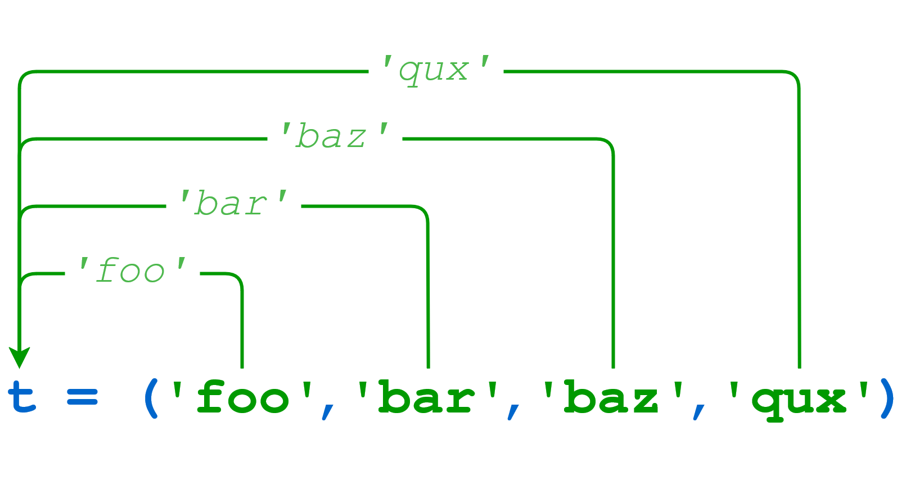

# Python Tuples

Python provides another type that is an ordered collection of objects, called a `tuple`.

Pronunciation varies depending on whom you ask.

Some pronounce it as though it were spelled "too-ple" (rhyming with "Mott the Hoople"), and others as though it were spelled "tup-ple" (rhyming with "supple").

## Defining and Using Tuples

Tuples are identical to lists in all respects, except for the following properties:

- Tuples are defined by enclosing the elements in parentheses (`()`) instead of square brackets (`[]`)
- Tuples are immutable

Here is a short example showing a tuple definition, indexing, and slicing:

```python
>>> t = ('foo', 'bar', 'baz', 'qux', 'quux', 'corge')
>>> t
('foo', 'bar', 'baz', 'qux', 'quux', 'corge')

>>> t[0]
'foo'
>>> t[-1]
'corge'
>>> t[1::2]
('bar', 'qux', 'corge')
```

Never fear! Our favorite string and list reversal mechanism works for tuples as well:

```python
>>> t[::-1]
('corge', 'quux', 'qux', 'baz', 'bar', 'foo')
```

__Note:__ Even though tuples are defined using parentheses, you still index and slice tuples using square brackets, just as for strings and lists.

Everything you’ve learned about lists &ndash; they are ordered, they can contain arbitrary objects, they can be indexed and sliced, they can be nested &ndash; is true of tuples as well. But they can’t be modified:

```python
>>> t = ('foo', 'bar', 'baz', 'qux', 'quux', 'corge')
>>> t[2] = 'Bark!'
Traceback (most recent call last):
  File "<pyshell#65>", line 1, in <module>
    t[2] = 'Bark!'
TypeError: 'tuple' object does not support item assignment
```

Why use a tuple instead of a list?

- Program execution is faster when manipulating a tuple than it is for the equivalent list. (This is probably not going to be noticeable when the list or tuple is small.)
- Sometimes you don’t want data to be modified. If the values in the collection are meant to remain constant for the life of the program, using a tuple instead of a list guards against accidental modification.
- There is another Python data type that you will encounter shortly called a dictionary, which requires as one of its components a value that is of an immutable type. A tuple can be used for this purpose, whereas a list can’t be.

In a Python REPL session, you can display the values of several objects simultaneously by entering them directly at the `>>>` prompt, separated by commas:

```python
>>> a = 'foo'
>>> b = 42
>>> a, 3.14159, b
('foo', 3.14159, 42)
```

Python displays the response in parentheses because it is implicitly interpreting the input as a tuple.

There is one peculiarity regarding tuple definition that you should be aware of. There is no ambiguity when defining an empty tuple, nor one with two or more elements. Python knows you are defining a tuple:

```python
>>> t = ()
>>> type(t)
<class 'tuple'>
>>> t = (1, 2)
>>> type(t)
<class 'tuple'>
>>> t = (1, 2, 3, 4, 5)
>>> type(t)
<class 'tuple'>
```

But what happens when you try to define a tuple with one item:

```python
>>> t = (2)
>>> type(t)
<class 'int'>
```

Since parentheses are also used to define operator precedence in expressions, Python evaluates the expression `(2)` as simply the integer 2 and creates an int object. To tell Python that you really want to define a singleton tuple, include a trailing comma (`,`) just before the closing parenthesis:

```python
>>> t = (2,)
>>> type(t)
<class 'tuple'>
>>> t[0]
2
>>> t[-1]
2
```

You probably won’t need to define a singleton tuple often, but there has to be a way.

When you display a singleton tuple, Python includes the comma, to remind you that it’s a tuple:

```python
>>> print(t)
(2,)
```

## Tuple Assignment, Packing, and Unpacking

As you have already seen above, a literal tuple containing several items can be assigned to a single object:

```python
>>> t = ('foo', 'bar', 'baz', 'qux')
```

When this occurs, it is as though the items in the tuple have been "packed" into the object:



```python
>>> t
('foo', 'bar', 'baz', 'qux')
>>> t[0]
'foo'
>>> t[-1]
'qux'
```

If that "packed" object is subsequently assigned to a new tuple, the individual items are "unpacked" into the objects in the tuple:


```python
>>> s1
'foo'
>>> s2
'bar'
>>> s3
'baz'
>>> s4
'qux'
```

When unpacking, the number of variables on the left must match the number of values in the tuple:

```python
>>> (s1, s2, s3) = t
Traceback (most recent call last):
  File "<pyshell#16>", line 1, in <module>
    (s1, s2, s3) = t
ValueError: too many values to unpack (expected 3)

>>> (s1, s2, s3, s4, s5) = t
Traceback (most recent call last):
  File "<pyshell#17>", line 1, in <module>
    (s1, s2, s3, s4, s5) = t
ValueError: not enough values to unpack (expected 5, got 4)
```

Packing and unpacking can be combined into one statement to make a compound assignment:

```python
>>> (s1, s2, s3, s4) = ('foo', 'bar', 'baz', 'qux')
>>> s1
'foo'
>>> s2
'bar'
>>> s3
'baz'
>>> s4
'qux'
```

Again, the number of elements in the tuple on the left of the assignment must equal the number on the right:

```python
>>> (s1, s2, s3, s4, s5) = ('foo', 'bar', 'baz', 'qux')
Traceback (most recent call last):
  File "<pyshell#63>", line 1, in <module>
    (s1, s2, s3, s4, s5) = ('foo', 'bar', 'baz', 'qux')
ValueError: not enough values to unpack (expected 5, got 4)
```

In assignments like this and a small handful of other situations, Python allows the parentheses that are usually used for denoting a tuple to be left out:

```python
>>> t = 1, 2, 3
>>> t
(1, 2, 3)

>>> x1, x2, x3 = t
>>> x1, x2, x3
(1, 2, 3)

>>> x1, x2, x3 = 4, 5, 6
>>> x1, x2, x3
(4, 5, 6)

>>> t = 2,
>>> t
(2,)
```

It works the same whether the parentheses are included or not, so if you have any doubt as to whether they’re needed, go ahead and include them.

Tuple assignment allows for a curious bit of idiomatic Python. Frequently when programming, you have two variables whose values you need to swap. In most programming languages, it is necessary to store one of the values in a temporary variable while the swap occurs like this:

```python
>>> a = 'foo'
>>> b = 'bar'
>>> a, b
('foo', 'bar')

>>># We need to define a temp variable to accomplish the swap.
>>> temp = a
>>> a = b
>>> b = temp

>>> a, b
('bar', 'foo')
In Python, the swap can be done with a single tuple assignment:

>>> a = 'foo'
>>> b = 'bar'
>>> a, b
('foo', 'bar')

>>># Magic time!
>>> a, b = b, a

>>> a, b
('bar', 'foo')
```

As anyone who has ever had to swap values using a temporary variable knows, being able to do it this way in Python is the pinnacle of modern technological achievement. It will never get better than this.
