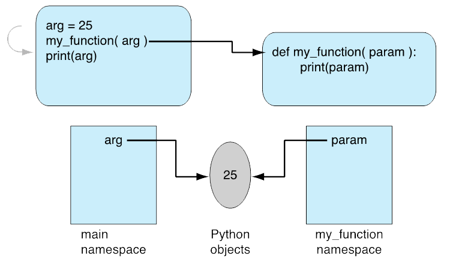
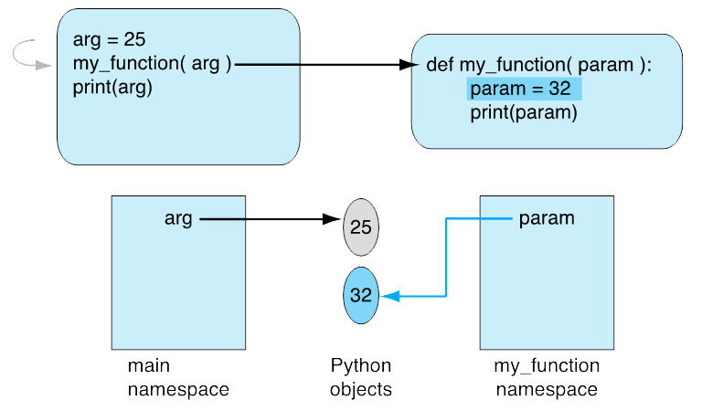
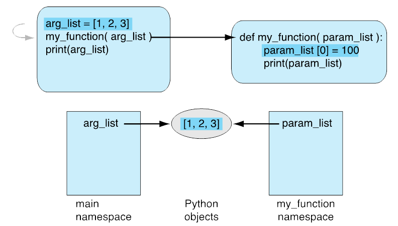
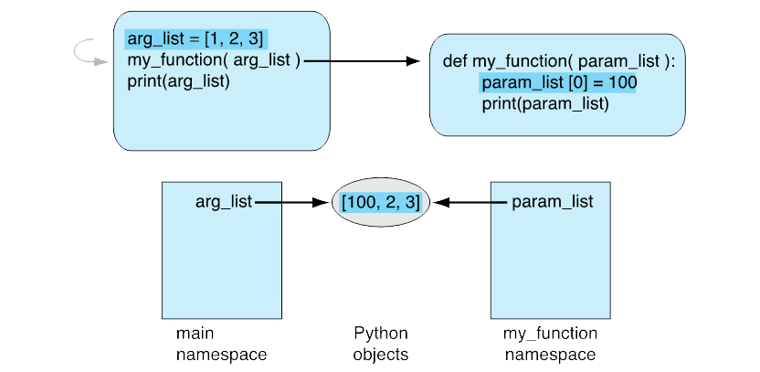

 # More on Functions

## Scope

 Scope defines where an identifier, such as a variable name, is _visible_, that is, can be referred to.

Functions are the first place we can really see the effect of scope.

```python
def scope_function(x):
    new_integer = x
    print(f"Inside scope_function(), new_integer = {new_integer}.")

scope_function(37)
print(f"Outside scope_function(), new_integer = {new_integer}.")  # ERROR
```

__Note:__ Identifiers are visible only in the namespace in which they are defined.

The module defines one namespace (the _global_ namespace).

The suite of a function is another.

### Arguments, Parameters, and Namespaces

Remember: a namespace contains sets of pairs: a _name_ and a _Python object_ associated with it.

We say that the name _references_ the object.

__When we call a function, what gets copied between the actual and formal parameters?__

Answer: the reference to the object, not the object itself.

```python
def my_function(formal_parameter):
    print(f"formal_parameters's value is {formal_parameter}, and its id is {id(formal_parameter)}")

actual_parameter = 25
print(f"actual_parameters's id is {id(actual_parameter)}")
my_function(actual_parameter)
```



`figure8.1.py`

Assignment creates a new object.

```python
def my_function(formal_parameter):
    formal_parameter = 32
    print(f"formal_parameters's value is {formal_parameter}, and its id is {id(formal_parameter)}")

actual_parameter = 25
print(f"actual_parameters's id is {id(actual_parameter)}")
my_function(actual_parameter)
```



`figure8.2.py`

### Passing Mutable Objects

Chapter 7 discussed _shallow copies_; i.e. making a copy of a reference rather than a copy of the object the reference refers to.

In the previous examples the object being passed was _immutable_. We cannot change the value of such an object. Instead, when it is assigned to, a new object is created and the reference is updated.

What about _mutable_ objects, though?

```python
def my_function(formal_parameter):
    print(f"before modification formal_parameters's value is {formal_parameter}")
    formal_parameter[0] = 100
    print(f"after modification formal_parameters's value is {formal_parameter}")

actual_parameter = [1, 2, 3]
my_function(actual_parameter)
print(f"after calling my_function, actual_parameters's value is {actual_parameter}")
```
`figure8.3.py`





__Remember:__ Passing mutable objects allows a function to change values when it is called.

### Returning a Complex Object

Every function returns a single value. However, that single value can be a list, a tuple, a dictionary, or _any_ Python data type.

## Default Values and Keyword Arguments

Two additional characteristics of Python formal parameters is that they can be given default values and we can use their names as a way of specifying just the values we want to provide.

```python
def rhyme(flower1="Roses", color1="red", flower2="Violets", color2="blue"):
    print(f"{flower1} are {color1}")
    print(f"{flower2} are {color2}")
    print("Sugar is sweet")
    print("And so are you")


rhyme()

rhyme("Daisies", "white")

rhyme(flower2="Irises")
```
`defaults_and_keywords.py`

__Remember:__ Any parameter name can be used as a keyword when a function is called. Give your formal parameters meaningful names.

__Remember:__ As previously discussed, you should be _very careful_ when using a mutable type as a default value.

## Functions as Objects

_Everything in Python is an object, including functions, which means they have attributes.

```python
>>> def my_func(param1, param2):
...     print(f"{param1}, {param2}")
...
>>> dir(my_func)
['__annotations__', '__call__', '__class__', '__closure__', '__code__', '__defaults__', '__delattr__', '__dict__', '__dir__', '__doc__', '__eq__', '__format__', '__ge__', '__get__', '__getattribute__', '__globals__', '__gt__', '__hash__', '__init__', '__init_subclass__', '__kwdefaults__', '__le__', '__lt__', '__module__', '__name__', '__ne__', '__new__', '__qualname__', '__reduce__', '__reduce_ex__', '__repr__', '__setattr__', '__sizeof__', '__str__', '__subclasshook__']
```

### Type Annotations

Python allows for optional annotations that indicate the type of variables, formal parameters, and function return types.

`annotations.py`

[mypy-lang.org](http://mypy-lang.org/)

[Python Type Checking (Guide)](https://realpython.com/python-type-checking/)

One of Python's strengths is that it is a dynamic language. Annotations give you the ability to add static type checking only when and where you _want_ it.


### Docstrings

Docstrings provide documentation for you, the programmer, and can also be used by other tools such as the `pydoc` module which will buile HTML help files or [Sphinx](http://sphinx.pocoo.org/) which can produce HTML, LaTeX (for printable PDF versions), manual pages, and plain text. There is also great, free hosting for your Sphinx docs at [Read The Docs](https://readthedocs.org/).

```python
def get_crater_tuple(line: str) -> Tuple[int, str, float, float, float]:
    """
    Build a tuple containing relevant crater information.

    The tuple will contain the crater ID (an int), its name (a string), its
    latitude, longitude, and diameter (all floats).
    """
```

I highly recommend reading [Documenting Python Code: A Complete Guide](https://realpython.com/documenting-python-code/).

## Example: Determining a Final Grade

`weighted_grade.py`

```python
#! /usr/bin/env python3.8
"""Calculate weighted grades."""

from typing import List, Tuple


def weighted_grade(
    scores: List[float], weights: Tuple[float, float, float] = (0.3, 0.3, 0.4)
) -> float:
    """Calculate a weighted grade.

    Given a list of three scores, the weighted grade will be calculated by
    multiplying each grade in turn by its weight.

    Arguments:
        scores {list} -- The scores to be weighted.

    Keyword Arguments:
        weights {tuple} -- The weights applied to each of the scores.
        (default: {(0.3, 0.3, 0.4)})

    Returns:
        float -- The computed weighted grade.

    """
    if len(scores) != 3:
        raise ValueError("You must provide exactly three scores.")

    if len(weights) != 3:
        raise ValueError("You must provide exactly three values to weigh the scores by.")

    return (scores[0] * weights[0]) + (scores[1] * weights[1]) + (scores[2] * weights[2])


def parse_line(line: str) -> Tuple[str, List[float]]:
    """Parse student info.

    Given a string containing a student's name and their grades return a tuple
    containing their information.

    Arguments:
        line {str} -- The student's name.
        List {float} -- The studen't grades.

    Returns:
        Tuple -- A tuple containing the student's name and a list of their
        grades.
    """
    fields: List[str] = line.strip().split(",")
    name: str = fields[1] + " " + fields[0]
    scores: List = []

    # gather the scores, now strings, as a list of floats
    for element in fields[2:]:
        scores.append(float(element))

    return name, scores


def main():
    """Get a line from the file, print the final grade nicely."""
    file_name: str = input("Open what file? ")

    with open(file_name, "r") as grade_file:
        print(f"{'Name':>13s}  {'Grade':>15s}")
        print("-" * 30)

        name: str = ""
        scores: List[float] = []

        for line in grade_file:
            name, scores = parse_line(line)
            grade = weighted_grade(scores)
            print(f"{name:>15s} {grade:14.2f}")


if __name__ == "__main__":
    main()
```
