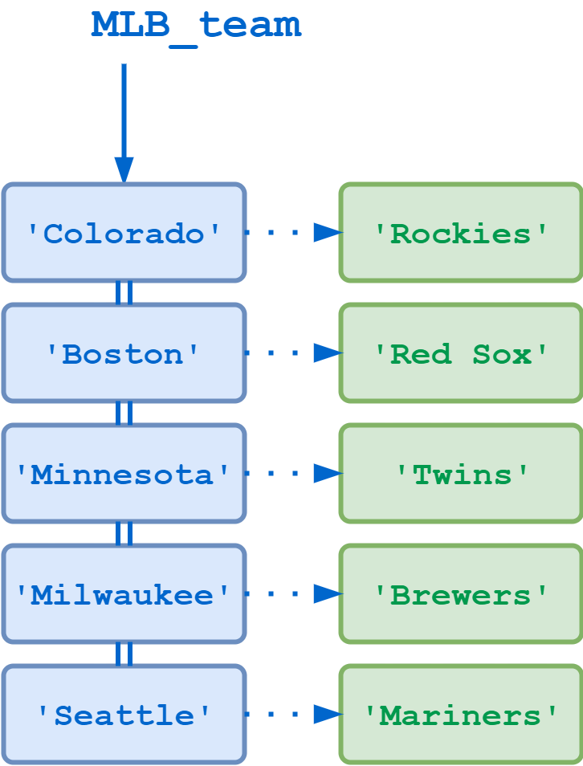

# Dictionaries

Dictionaries and lists share the following characteristics:

- Both are mutable
- Both are dynamic, they can grow and shrink as needed
- Both can be nested; a list can contain another list and a dictionary can contain another dictionary (a dictionary can also contain a list, and vice versa)

Dictionaries differ from lists primarily in how elements are accessed:

- List elements are accessed by their position in the list, via indexing
- Dictionary elements are accessed via keys

## Defining a Dictionary

Dictionaries are Python’s implementation of a data structure that is more generally known as an _associative array_.

A dictionary consists of a collection of _key-value pairs_. Each key-value pair maps the key to its associated value.

You can define a dictionary by enclosing a comma-separated list of key-value pairs in curly braces ({}). A colon (:) separates each key from its associated value:

```python
d = {
    <key>: <value>,
    <key>: <value>,
      .
      .
      .
    <key>: <value>
}
```

The following defines a dictionary that maps a location to the name of its corresponding Major League Baseball team:

```python
>>> MLB_team = {
...     'Colorado' : 'Rockies',
...     'Boston'   : 'Red Sox',
...     'Minnesota': 'Twins',
...     'Milwaukee': 'Brewers',
...     'Seattle'  : 'Mariners'
... }
```



You can also construct a dictionary with the built-in `dict()` function. The argument to `dict()` should be a sequence of key-value pairs. A list of tuples works well for this:

```python
d = dict([
    (<key>, <value>),
    (<key>, <value),
      .
      .
      .
    (<key>, <value>)
])
```

MLB_team can then also be defined this way:

```python
>>> MLB_team = dict([
...     ('Colorado', 'Rockies'),
...     ('Boston', 'Red Sox'),
...     ('Minnesota', 'Twins'),
...     ('Milwaukee', 'Brewers'),
...     ('Seattle', 'Mariners')
... ])
```

If the key values are simple strings, they can be specified as keyword arguments. So here is yet another way to define MLB_team:

```python
>>> MLB_team = dict(
...     Colorado='Rockies',
...     Boston='Red Sox',
...     Minnesota='Twins',
...     Milwaukee='Brewers',
...     Seattle='Mariners'
... )
```

Once you’ve defined a dictionary, you can display its contents, the same as you can do for a list. All three of the definitions shown above appear as follows when displayed:

```python
>>> type(MLB_team)
<class 'dict'>

>>> MLB_team
{'Colorado': 'Rockies', 'Boston': 'Red Sox', 'Minnesota': 'Twins',
'Milwaukee': 'Brewers', 'Seattle': 'Mariners'}
The entries in the dictionary display in the order they were defined. But that is irrelevant when it comes to retrieving them. Dictionary elements are not accessed by numerical index:

>>> MLB_team[1]
Traceback (most recent call last):
  File "<pyshell#13>", line 1, in <module>
    MLB_team[1]
KeyError: 1
```

## Accessing Dictionary Values

Of course, dictionary elements must be accessible somehow. If you don’t get them by index, then how do you get them?

A value is retrieved from a dictionary by specifying its corresponding key in square brackets (`[]`):

```python
>>> MLB_team['Minnesota']
'Twins'
>>> MLB_team['Colorado']
'Rockies'
```

If you refer to a key that is not in the dictionary, Python raises an exception:

```python
>>> MLB_team['Toronto']
Traceback (most recent call last):
  File "<pyshell#19>", line 1, in <module>
    MLB_team['Toronto']
KeyError: 'Toronto'
```

Adding an entry to an existing dictionary is simply a matter of assigning a new key and value:

```python
>>> MLB_team['Kansas City'] = 'Royals'
>>> MLB_team
{'Colorado': 'Rockies', 'Boston': 'Red Sox', 'Minnesota': 'Twins',
'Milwaukee': 'Brewers', 'Seattle': 'Mariners', 'Kansas City': 'Royals'}
```

If you want to update an entry, you can just assign a new value to an existing key:

```python
>>> MLB_team['Seattle'] = 'Seahawks'
>>> MLB_team
{'Colorado': 'Rockies', 'Boston': 'Red Sox', 'Minnesota': 'Twins',
'Milwaukee': 'Brewers', 'Seattle': 'Seahawks', 'Kansas City': 'Royals'}
```

To delete an entry, use the `del` statement, specifying the key to delete:

```python
>>> del MLB_team['Seattle']
>>> MLB_team
{'Colorado': 'Rockies', 'Boston': 'Red Sox', 'Minnesota': 'Twins',
'Milwaukee': 'Brewers', 'Kansas City': 'Royals'}
```

_Begone, Seahawks! Thou art an NFL team._

## Dictionary Keys vs List Indices

Pthon raises the same exception, `KeyError`, when a dictionary is accessed with either an undefined key or by a numeric index:

```python
>>> MLB_team['Toronto']
Traceback (most recent call last):
  File "<pyshell#8>", line 1, in <module>
    MLB_team['Toronto']
KeyError: 'Toronto'

>>> MLB_team[1]
Traceback (most recent call last):
  File "<pyshell#9>", line 1, in <module>
    MLB_team[1]
KeyError: 1
```

In truth, it iss the same error. In the latter case, [1] looks like a numerical index, but it isn’t.

As you will see, an object of _any_ immutable type can be used as a dictionary key. Accordingly, there is no reason you can’t use integers:

```python
>>> d = {0: 'a', 1: 'b', 2: 'c', 3: 'd'}
>>> d
{0: 'a', 1: 'b', 2: 'c', 3: 'd'}

>>> d[0]
'a'
>>> d[2]
'c'
```

In the expressions `MLB_team[1]`, `d[0]`, and `d[2]`, the numbers in square brackets appear as though they might be indices, but they have nothing to do with the order of the items in the dictionary.

Python is interpreting them as dictionary keys. If you define this same dictionary in reverse order, you still get the same values using the same keys:

```python
>>> d = {3: 'd', 2: 'c', 1: 'b', 0: 'a'}
>>> d
{3: 'd', 2: 'c', 1: 'b', 0: 'a'}

>>> d[0]
'a'
>>> d[2]
'c'
```

The syntax may look similar, but you can’t treat a dictionary like a list:

```python
>>> type(d)
<class 'dict'>

>>> d[-1]
Traceback (most recent call last):
  File "<pyshell#30>", line 1, in <module>
    d[-1]
KeyError: -1

>>> d[0:2]
Traceback (most recent call last):
  File "<pyshell#31>", line 1, in <module>
    d[0:2]
TypeError: unhashable type: 'slice'

>>> d.append('e')
Traceback (most recent call last):
  File "<pyshell#32>", line 1, in <module>
    d.append('e')
AttributeError: 'dict' object has no attribute 'append'
```

- __Note:__ _Although access to items in a dictionary does not depend on order, Python does guarantee that the order of items in a dictionary is preserved. When displayed, items will appear in the order they were defined, and iteration through the keys will occur in that order as well. Items added to a dictionary are added at the end. If items are deleted, the order of the remaining items is retained._

    _You can only count on this preservation of order very recently. It was added as a part of the Python language specification in version 3.7. However, it was true as of version 3.6 as well—by happenstance as a result of the implementation but not guaranteed by the language specification._

## Building a Dictionary Incrementally

Defining a dictionary using curly braces and a list of key-value pairs, as shown above, is fine if you know all the keys and values in advance. But what if you want to build a dictionary on the fly?

You can start by creating an empty dictionary, which is specified by empty curly braces. Then you can add new keys and values one at a time:

```python
>>> person = {}
>>> type(person)
<class 'dict'>

>>> person['fname'] = 'Joe'
>>> person['lname'] = 'Fonebone'
>>> person['age'] = 51
>>> person['spouse'] = 'Edna'
>>> person['children'] = ['Ralph', 'Betty', 'Joey']
>>> person['pets'] = {'dog': 'Fido', 'cat': 'Sox'}
```

Once the dictionary is created in this way, its values are accessed the same way as any other dictionary:

```python
>>> person
{'fname': 'Joe', 'lname': 'Fonebone', 'age': 51, 'spouse': 'Edna',
'children': ['Ralph', 'Betty', 'Joey'], 'pets': {'dog': 'Fido', 'cat': 'Sox'}}

>>> person['fname']
'Joe'
>>> person['age']
51
>>> person['children']
['Ralph', 'Betty', 'Joey']
```

Retrieving the values in the sublist or subdictionary requires an additional index or key:

```python
>>> person['children'][-1]
'Joey'
>>> person['pets']['cat']
'Sox'
```

This example exhibits another feature of dictionaries: the values contained in the dictionary don’t need to be the same type. In `person`, some of the values are strings, one is an integer, one is a list, and one is another dictionary.

Just as the values in a dictionary don’t need to be of the same type, the keys don’t either:

```python
>>> foo = {42: 'aaa', 2.78: 'bbb', True: 'ccc'}
>>> foo
{42: 'aaa', 2.78: 'bbb', True: 'ccc'}

>>> foo[42]
'aaa'
>>> foo[2.78]
'bbb'
>>> foo[True]
'ccc'
```

Here, one of the keys is an `int`, one is a `float`, and one is a `bool`. It’s not obvious how this would be useful, but you never know.

Notice how versatile Python dictionaries are. In `MLB_team`, the same piece of information (the baseball team name) is kept for each of several different geographical locations. `person`, on the other hand, stores varying types of data for a single person.

You can use dictionaries for a wide range of purposes because there are so few limitations on the keys and values that are allowed. But there are some. Read on!

## Restrictions on Dictionary Keys

Almost any type of value can be used as a dictionary key in Python. You just saw this example, where integer, float, and Boolean objects are used as keys:

```python
>>> foo = {42: 'aaa', 2.78: 'bbb', True: 'ccc'}
>>> foo
{42: 'aaa', 2.78: 'bbb', True: 'ccc'}
You can even use built-in objects like types and functions:

>>> d = {int: 1, float: 2, bool: 3}
>>> d
{<class 'int'>: 1, <class 'float'>: 2, <class 'bool'>: 3}
>>> d[float]
2

>>> d = {bin: 1, hex: 2, oct: 3}
>>> d[oct]
3
```

However, there are a couple restrictions that dictionary keys must abide by.

First, _a given key can appear in a dictionary only once_. Duplicate keys are not allowed. A dictionary maps each key to a corresponding value, so it doesn’t make sense to map a particular key more than once.

You saw above that when you assign a value to an already existing dictionary key, it does not add the key a second time, but replaces the existing value:

```python
>>> MLB_team = {
...     'Colorado' : 'Rockies',
...     'Boston'   : 'Red Sox',
...     'Minnesota': 'Twins',
...     'Milwaukee': 'Brewers',
...     'Seattle'  : 'Mariners'
... }

>>> MLB_team['Minnesota'] = 'Timberwolves'
>>> MLB_team
{'Colorado': 'Rockies', 'Boston': 'Red Sox', 'Minnesota': 'Timberwolves',
'Milwaukee': 'Brewers', 'Seattle': 'Mariners'}
```

Similarly, if you specify a key a second time during the initial creation of a dictionary, the second occurrence will override the first:

```python
>>> MLB_team = {
...     'Colorado' : 'Rockies',
...     'Boston'   : 'Red Sox',
...     'Minnesota': 'Timberwolves',
...     'Milwaukee': 'Brewers',
...     'Seattle'  : 'Mariners',
...     'Minnesota': 'Twins'
... }
>>> MLB_team
{'Colorado': 'Rockies', 'Boston': 'Red Sox', 'Minnesota': 'Twins',
'Milwaukee': 'Brewers', 'Seattle': 'Mariners'}
```

Secondly, _a dictionary key must be of a type that is immutable_. You have already seen examples where several of the immutable types you are familiar with—integer, float, string, and Boolean—have served as dictionary keys.

A tuple can also be a dictionary key, because tuples are immutable:

```python
>>> d = {(1, 1): 'a', (1, 2): 'b', (2, 1): 'c', (2, 2): 'd'}
>>> d[(1,1)]
'a'
>>> d[(2,1)]
'c'
```

(Recall from the discussion on tuples that one rationale for using a tuple instead of a list is that there are circumstances where an immutable type is required. This is one of them.)

However, neither a list nor another dictionary can serve as a dictionary key, because lists and dictionaries are mutable:

```python
>>> d = {[1, 1]: 'a', [1, 2]: 'b', [2, 1]: 'c', [2, 2]: 'd'}
Traceback (most recent call last):
  File "<pyshell#20>", line 1, in <module>
    d = {[1, 1]: 'a', [1, 2]: 'b', [2, 1]: 'c', [2, 2]: 'd'}
TypeError: unhashable type: 'list'
```

- __Technical Note:__ _Why does the error message say "unhashable"?

    _Technically, it is not quite correct to say an object must be immutable to be used as a dictionary key. More precisely, an object must be hashable, which means it can be passed to a hash function. A hash function takes data of arbitrary size and maps it to a relatively simpler fixed-size value called a hash value (or simply hash), which is used for table lookup and comparison._

    _Python’s built-in `hash()` function returns the hash value for an object which is hashable, and raises an exception for an object which isn’t:_

    ```python
    >>> hash('foo')
    11132615637596761

    >>> hash([1, 2, 3])
    Traceback (most recent call last):
    File "<stdin>", line 1, in <module>
    TypeError: unhashable type: 'list'
    ```

    _All of the built-in immutable types you have learned about so far are hashable, and the mutable container types (lists and dictionaries) are not. So for present purposes, you can think of hashable and immutable as more or less synonymous._

    _In future tutorials, you will encounter mutable objects which are also hashable._

## Restrictions on Dictionary Values

By contrast, there are _no_ restrictions on dictionary values. None at all.

There is also no restriction against a particular value appearing in a dictionary multiple times:

```python
>>> d = {0: 'a', 1: 'a', 2: 'a', 3: 'a'}
>>> d
{0: 'a', 1: 'a', 2: 'a', 3: 'a'}
>>> d[0] == d[1] == d[2]
True
```

## Operators and Built-In Functions

You should already be familiar with many of the operators and built-in functions that can be used with types such as strings, lists, and tuples. Many of these work with dictionaries as well.

For example, the `in` and `not in` operators return `True` or `False` according to whether the specified operand occurs as a key in the dictionary:

```python
>>> MLB_team = {
...     'Colorado' : 'Rockies',
...     'Boston'   : 'Red Sox',
...     'Minnesota': 'Twins',
...     'Milwaukee': 'Brewers',
...     'Seattle'  : 'Mariners'
... }

>>> 'Milwaukee' in MLB_team
True
>>> 'Toronto' in MLB_team
False
>>> 'Toronto' not in MLB_team
True
```

You can use the `in` operator together with short-circuit evaluation to avoid raising an error when trying to access a key that is not in the dictionary:

```python
>>> MLB_team['Toronto']
Traceback (most recent call last):
  File "<pyshell#2>", line 1, in <module>
    MLB_team['Toronto']
KeyError: 'Toronto'

>>> 'Toronto' in MLB_team and MLB_team['Toronto']
False
```

In the second case, due to short-circuit evaluation, the expression `MLB_team['Toronto']` is not evaluated, so the `KeyError` exception does not occur.

The `len()` function returns the number of key-value pairs in a dictionary:

```python
>>> MLB_team = {
...     'Colorado' : 'Rockies',
...     'Boston'   : 'Red Sox',
...     'Minnesota': 'Twins',
...     'Milwaukee': 'Brewers',
...     'Seattle'  : 'Mariners'
... }
>>> len(MLB_team)
5
```

## Built-In Dictionary Methods

`d.clear()`

> Clears a dictionary.

`d.clear()` empties dictionary `d` of all key-value pairs:

```python
>>> d = {'a': 10, 'b': 20, 'c': 30}
>>> d
{'a': 10, 'b': 20, 'c': 30}

>>> d.clear()
>>> d
{}
```

`d.get(<key>[,default])`

> Returns the value for a key if it exists in the dictionary.

`.get()` provides a convenient way of getting the value of a key from a dictionary without checking ahead of time whether the key exists, and without raising an error.

`d.get(<key>)` searches dictionary `d` for `<key>` and returns the associated value if it is found. If `<key>` is not found, it returns `None`:

```python
>>> d = {'a': 10, 'b': 20, 'c': 30}

>>> print(d.get('b'))
20
>>> print(d.get('z'))
None
```

If `<key>` is not found and the optional `<default>` argument is specified, that value is returned instead of `None`:

```python
>>> print(d.get('z', -1))
-1
```

`d.items()`

> Returns a list of key-value pairs in a dictionary.

`d.items()` returns a list of tuples containing the key-value pairs in d. The first item in each tuple is the key, and the second item is the key’s value:

```python
>>> d = {'a': 10, 'b': 20, 'c': 30}
>>> d
{'a': 10, 'b': 20, 'c': 30}

>>> list(d.items())
[('a', 10), ('b', 20), ('c', 30)]
>>> list(d.items())[1][0]
'b'
>>> list(d.items())[1][1]
20
```

`d.keys()`

> Returns a list of keys in a dictionary.

`d.keys()` returns a list of all keys in `d`:

```python
>>> d = {'a': 10, 'b': 20, 'c': 30}
>>> d
{'a': 10, 'b': 20, 'c': 30}

>>> list(d.keys())
['a', 'b', 'c']
```

`d.values()`

> Returns a list of values in a dictionary.

`d.values()` returns a list of all values in `d`:

```python
>>> d = {'a': 10, 'b': 20, 'c': 30}
>>> d
{'a': 10, 'b': 20, 'c': 30}

>>> list(d.values())
[10, 20, 30]
```

Any duplicate values in `d` will be returned as many times as they occur:

```python
>>> d = {'a': 10, 'b': 10, 'c': 10}
>>> d
{'a': 10, 'b': 10, 'c': 10}

>>> list(d.values())
[10, 10, 10]
```

- __Technical Note:__ _The `.items()`, `.keys()`, and `.values()` methods actually return something called a __view object__. A dictionary view object is more or less like a window on the keys and values. For practical purposes, you can think of these methods as returning lists of the dictionary’s keys and values._

`d.pop(<key>[,default])`

> Removes a key from a dictionary, if it is present, and returns its value.

If `<key>` is present in `d`, `d.pop(<key>)` removes `<key>` and returns its associated value:

```python
>>> d = {'a': 10, 'b': 20, 'c': 30}

>>> d.pop('b')
20
>>> d
{'a': 10, 'c': 30}
```

`d.pop(<key>)` raises a `KeyError` exception if `<key>` is not in `d`:

```python
>>> d = {'a': 10, 'b': 20, 'c': 30}

>>> d.pop('z')
Traceback (most recent call last):
  File "<pyshell#4>", line 1, in <module>
    d.pop('z')
KeyError: 'z'
```

If <key> is not in d, and the optional <default> argument is specified, then that value is returned, and no exception is raised:

>>> d = {'a': 10, 'b': 20, 'c': 30}
>>> d.pop('z', -1)
-1
>>> d
{'a': 10, 'b': 20, 'c': 30}

`d.popitem()`

> Removes a key-value pair from a dictionary.

`d.popitem()` removes a random, arbitrary key-value pair from `d` and returns it as a tuple:

```python
>>> d = {'a': 10, 'b': 20, 'c': 30}

>>> d.popitem()
('c', 30)
>>> d
{'a': 10, 'b': 20}

>>> d.popitem()
('b', 20)
>>> d
{'a': 10}
```

If `d` is empty, `d.popitem()` raises a `KeyError` exception:

```python
>>> d = {}
>>> d.popitem()
Traceback (most recent call last):
  File "<pyshell#11>", line 1, in <module>
    d.popitem()
KeyError: 'popitem(): dictionary is empty'
```

`d.update(<obj>)`

> Merges a dictionary with another dictionary or with an iterable of key-value pairs.

If `<obj>` is a dictionary, `d.update(<obj>)` merges the entries from `<obj>` into `d`. For each key in `<obj>`:

- If the key is not present in `d`, the key-value pair from `<obj>` is added to `d`.
- If the key is already present in `d`, the corresponding value in `d` for that key is updated to the value from `<obj>`.

Here is an example showing two dictionaries merged together:

```python
>>> d1 = {'a': 10, 'b': 20, 'c': 30}
>>> d2 = {'b': 200, 'd': 400}

>>> d1.update(d2)
>>> d1
{'a': 10, 'b': 200, 'c': 30, 'd': 400}
```

In this example, key `'b'` already exists in `d1`, so its value is updated to `200`, the value for that key from `d2`. However, there is no key `'d'` in `d1`, so that key-value pair is added from `d2`.

`<obj>` may also be a sequence of key-value pairs, similar to when the `dict()` function is used to define a dictionary. For example, `<obj>` can be specified as a list of tuples:

```python
>>> d1 = {'a': 10, 'b': 20, 'c': 30}
>>> d1.update([('b', 200), ('d', 400)])
>>> d1
{'a': 10, 'b': 200, 'c': 30, 'd': 400}
```

Or the values to merge can be specified as a list of keyword arguments:

```python
>>> d1 = {'a': 10, 'b': 20, 'c': 30}
>>> d1.update(b=200, d=400)
>>> d1
{'a': 10, 'b': 200, 'c': 30, 'd': 400}
```
