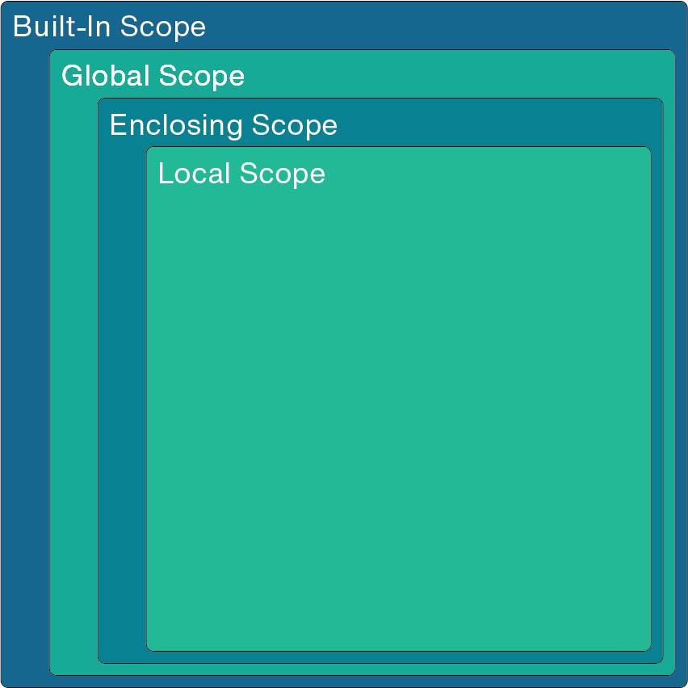

# More on Scope

Previously we've discussed scope mainly in the context of functions. Now, with dictionaries at our disposal, we can delve deeper.

While novice programmers can get by without a deep understanding of scope, a greater understanding is useful for advanced programmers in both Python and other languages.

Additionally, a better understanding of scope can help you understand some error messages.

## Namespace and Scope

A namespace is a relationship between names and objects and are used to determine what object is associated with a particular identifier.

In Python you can have multiple namespaces.

These namespaces _do not_ share names.

However, these namespaces can be crossed in an effort to resolve an identifier.

## Search Rule for Scope

LEGB

- __L__ ocal
- __E__ nclosing
- __G__ obal
- __B__ uilt-in

The local, global, and built-in namespaces are pretty easy to understand.

demo: `ns_demo.py`

With those firmly in mind, enclosing is now also easy to grasp.

demo: `ns_demo_2.py`
