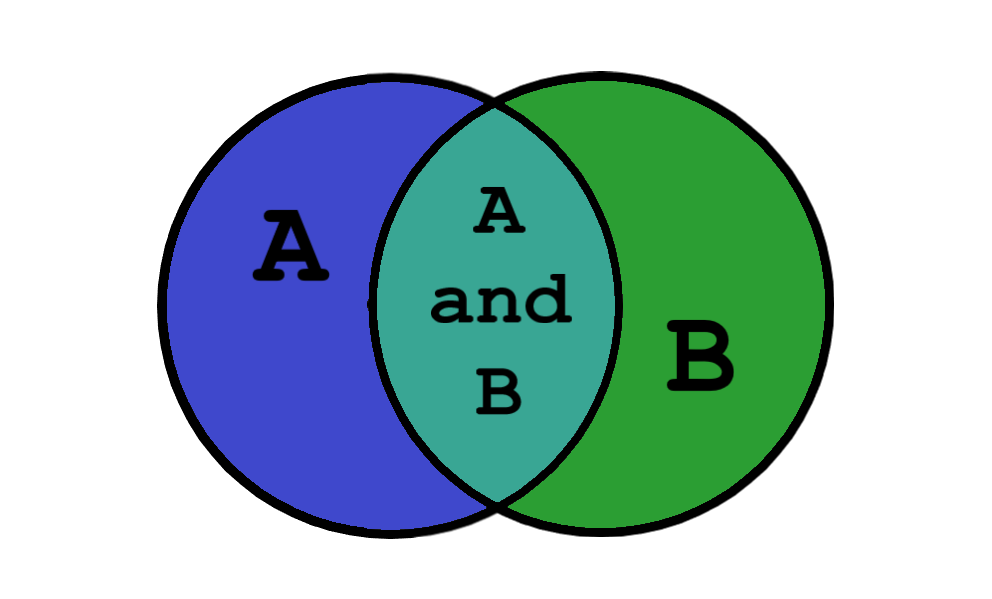
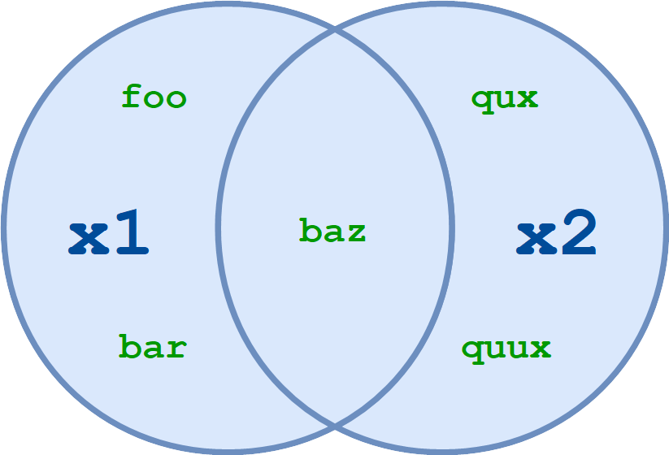
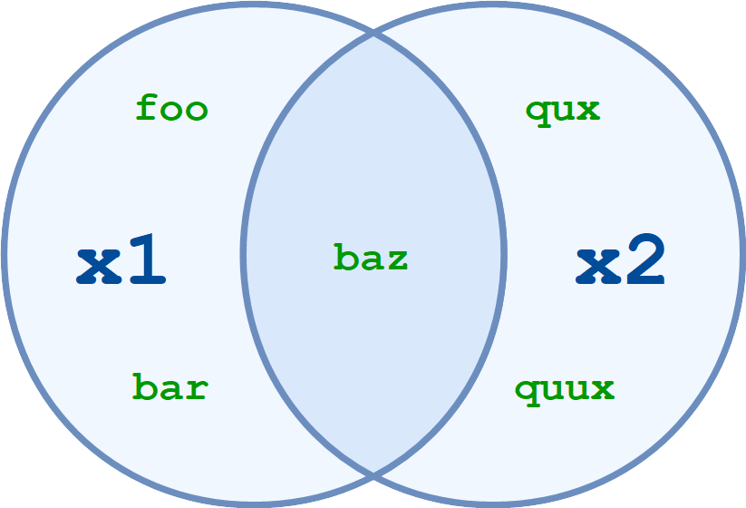
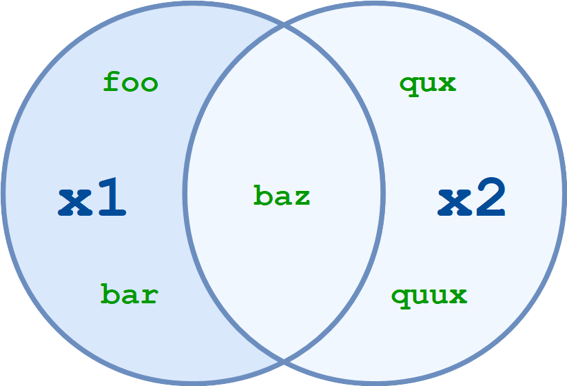
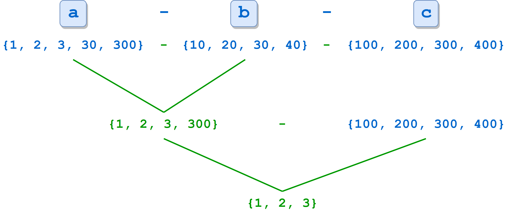
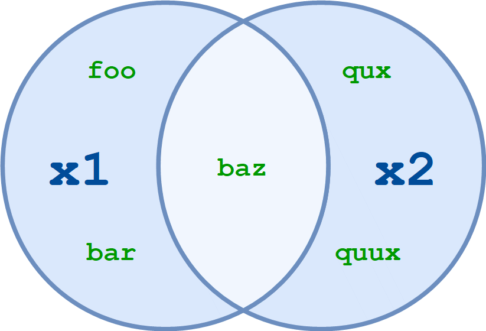

# Sets

You may recall learning about __sets__ and __set theory__ at some point in your mathematical education. Maybe you even remember Venn diagrams:



In mathematics, a rigorous definition of a set can be abstract and difficult to grasp. Practically though, a set can be thought of simply as a well-defined collection of distinct objects, typically called __elements__ or __members__.

Grouping objects into a set can be useful in programming as well, and Python provides a built-in set type to do so. Sets are distinguished from other object types by the unique operations that can be performed on them.

## Defining a Set

Python’s built-in set type has the following characteristics:

- Sets are unordered.
- Set elements are unique. Duplicate elements are not allowed.
- A set itself may be modified, but the elements contained in the set must be of an immutable type.

A set can be created in two ways. First, you can define a set with the built-in 'set()' function:

```python
x = set(<iter>)
```

In this case, the argument `<iter>` is any iterable.

```python
>>> x = set(['foo', 'bar', 'baz', 'foo', 'qux'])
>>> x
{'qux', 'foo', 'bar', 'baz'}

>>> x = set(('foo', 'bar', 'baz', 'foo', 'qux'))
>>> x
{'qux', 'foo', 'bar', 'baz'}
```

Strings are also iterable, so a string can be passed to `set()` as well. You have already seen that `list(s)` generates a list of the characters in the string `s`. Similarly, `set(s)` generates a set of the characters in `s`:

```python
>>> s = 'quux'

>>> list(s)
['q', 'u', 'u', 'x']
>>> set(s)
{'x', 'u', 'q'}
```

You can see that the resulting sets are unordered: the original order, as specified in the definition, is not necessarily preserved.

Additionally, duplicate values are only represented in the set once, as with the string `'foo'` in the first two examples and the letter `'u'` in the third.

Alternately, a set can be defined with curly braces (`{}`):

```python
x = {<obj>, <obj>, ..., <obj>}
```

When a set is defined this way, each `<obj>` becomes a distinct element of the set, even if it is an iterable. This behavior is similar to that of the `.append()` list method.

Thus, the sets shown above can also be defined like this:

```python
>>> x = {'foo', 'bar', 'baz', 'foo', 'qux'}
>>> x
{'qux', 'foo', 'bar', 'baz'}

>>> x = {'q', 'u', 'u', 'x'}
>>> x
{'x', 'q', 'u'}
```

To recap:

The argument to `set()` is an iterable. It generates a list of elements to be placed into the set.

The objects in curly braces are placed into the set intact, even if they are iterable.
Observe the difference between these two set definitions:

```python
>>> {'foo'}
{'foo'}

>>> set('foo')
{'o', 'f'}
```

A set can be empty. However, recall that Python interprets empty curly braces (`{}`) as an empty dictionary, so the only way to define an empty set is with the `set()` function:

```python
>>> x = set()
>>> type(x)
<class 'set'>
>>> x
set()

>>> x = {}
>>> type(x)
<class 'dict'>
```

An empty set is _falsy_ in Boolean context:

```python
>>> x = set()
>>> bool(x)
False
>>> x or 1
1
>>> x and 1
set()
```

You might think the most intuitive sets would contain similar objects—for example, even numbers or surnames:

```python
>>> s1 = {2, 4, 6, 8, 10}
>>> s2 = {'Smith', 'McArthur', 'Wilson', 'Johansson'}
```

Python does not require this, though. The elements in a set can be objects of different types:

```python
>>> x = {42, 'foo', 3.14159, None}
>>> x
{None, 'foo', 42, 3.14159}
```

Set elements must be immutable. For example, a tuple may be included in a set:

```python
>>> x = {42, 'foo', (1, 2, 3), 3.14159}
>>> x
{42, 'foo', 3.14159, (1, 2, 3)}
```

But lists and dictionaries are mutable, so they can’t be set elements:

```python
>>> a = [1, 2, 3]
>>> {a}
Traceback (most recent call last):
  File "<pyshell#70>", line 1, in <module>
    {a}
TypeError: unhashable type: 'list'

>>> d = {'a': 1, 'b': 2}
>>> {d}
Traceback (most recent call last):
  File "<pyshell#72>", line 1, in <module>
    {d}
TypeError: unhashable type: 'dict'
```

## Set Size and Membership

The `len()` function returns the number of elements in a set, and the `in` and `not in` operators can be used to test for membership:

```python
>>> x = {'foo', 'bar', 'baz'}

>>> len(x)
3

>>> 'bar' in x
True
>>> 'qux' in x
False
```

## Operating on a Set

Many of the operations that can be used for Python’s other composite data types don’t make sense for sets.

For example, sets can’t be indexed or sliced. However, Python provides a whole host of operations on set objects that generally mimic the operations that are defined for mathematical sets.

### Operators vs. Methods

Most, though not quite all, set operations in Python can be performed in two different ways: by operator or by method. Let’s take a look at how these operators and methods work, using set union as an example.

Given two sets, `x1` and `x2`, the union of `x1` and `x2` is a set consisting of all elements in either set.

Consider these two sets:

```python
x1 = {'foo', 'bar', 'baz'}
x2 = {'baz', 'qux', 'quux'}
```

The union of `x1` and `x2` is `{'foo', 'bar', 'baz', 'qux', 'quux'}`.

- __Note:__ _Notice that the element 'baz', which appears in both x1 and x2, appears only once in the union. Sets never contain duplicate values._

In Python, set union can be performed with the `|` operator:

```python
>>> x1 = {'foo', 'bar', 'baz'}
>>> x2 = {'baz', 'qux', 'quux'}
>>> x1 | x2
{'baz', 'quux', 'qux', 'bar', 'foo'}
```

Set union can also be obtained with the `.union()` method. The method is invoked on one of the sets, and the other is passed as an argument:

```python
>>> x1.union(x2)
{'baz', 'quux', 'qux', 'bar', 'foo'}
```

The way they are used in the examples above, the operator and method behave identically. But there is a subtle difference between them.

When you use the `|` operator, both operands must be sets. The `.union()` method, on the other hand, will take any iterable as an argument, convert it to a set, and then perform the union.

```python
>>> x1 | ('baz', 'qux', 'quux')
Traceback (most recent call last):
  File "<pyshell#43>", line 1, in <module>
    x1 | ('baz', 'qux', 'quux')
TypeError: unsupported operand type(s) for |: 'set' and 'tuple'

>>> x1.union(('baz', 'qux', 'quux'))
{'baz', 'quux', 'qux', 'bar', 'foo'}
```

Both attempt to compute the union of `x1` and the tuple `('baz', 'qux', 'quux')`. This fails with the `|` operator but succeeds with the `.union()` method.

### Available Operators and Methods

Following is a list of the set operations available in Python. Some are performed by operator, some by method, and some by both. The principle outlined above generally applies: where a set is expected, methods will typically accept any iterable as an argument, but operators require actual sets as operands.

```python
x1.union(x2[, x3 ...])
x1 | x2 [| x3 ...]
```

> Compute the union of two or more sets.



`x1.union(x2)` and `x1 | x2` both return the set of all elements in either `x1` or `x2`:

```python
>>> x1 = {'foo', 'bar', 'baz'}
>>> x2 = {'baz', 'qux', 'quux'}

>>> x1.union(x2)
{'foo', 'qux', 'quux', 'baz', 'bar'}

>>> x1 | x2
{'foo', 'qux', 'quux', 'baz', 'bar'}
```

More than two sets may be specified with either the operator or the method:

```python
>>> a = {1, 2, 3, 4}
>>> b = {2, 3, 4, 5}
>>> c = {3, 4, 5, 6}
>>> d = {4, 5, 6, 7}

>>> a.union(b, c, d)
{1, 2, 3, 4, 5, 6, 7}

>>> a | b | c | d
{1, 2, 3, 4, 5, 6, 7}
```

The resulting set contains all elements that are present in any of the specified sets.

```python
x1.intersection(x2[, x3 ...])
x1 & x2 [& x3 ...]
```

> Compute the intersection of two or more sets.



`x1.intersection(x2)` and `x1 & x2` return the set of elements common to both `x1` and `x2`:

```python
>>> x1 = {'foo', 'bar', 'baz'}
>>> x2 = {'baz', 'qux', 'quux'}

>>> x1.intersection(x2)
{'baz'}

>>> x1 & x2
{'baz'}
```

You can specify multiple sets with the intersection method and operator, just like you can with set union:

```python
>>> a = {1, 2, 3, 4}
>>> b = {2, 3, 4, 5}
>>> c = {3, 4, 5, 6}
>>> d = {4, 5, 6, 7}

>>> a.intersection(b, c, d)
{4}

>>> a & b & c & d
{4}
```

The resulting set contains only elements that are present in all of the specified sets.

```python
x1.difference(x2[, x3 ...])
x1 - x2 [- x3 ...]
```

> Compute the difference between two or more sets.



`x1.difference(x2)` and `x1 - x2` return the set of all elements that are in `x1` but not in `x2`:

```python
>>> x1 = {'foo', 'bar', 'baz'}
>>> x2 = {'baz', 'qux', 'quux'}

>>> x1.difference(x2)
{'foo', 'bar'}

>>> x1 - x2
{'foo', 'bar'}
```

Another way to think of this is that `x1.difference(x2)` and `x1 - x2` return the set that results when any elements in `x2` are removed or subtracted from `x1`.

Once again, you can specify more than two sets:

```python
>>> a = {1, 2, 3, 30, 300}
>>> b = {10, 20, 30, 40}
>>> c = {100, 200, 300, 400}

>>> a.difference(b, c)
{1, 2, 3}

>>> a - b - c
{1, 2, 3}
```

When multiple sets are specified, the operation is performed from left to right. In the example above, `a - b` is computed first, resulting in `{1, 2, 3, 300}`. Then `c` is subtracted from that set, leaving `{1, 2, 3}`:



```python
x1.symmetric_difference(x2)
x1 ^ x2 [^ x3 ...]
```

> Compute the [symmetric difference](https://en.wikipedia.org/wiki/Symmetric_difference) between sets.



`x1.symmetric_difference(x2)` and `x1 ^ x2` return the set of all elements in either `x1` or `x2`, but not both:

```python
>>> x1 = {'foo', 'bar', 'baz'}
>>> x2 = {'baz', 'qux', 'quux'}

>>> x1.symmetric_difference(x2)
{'foo', 'qux', 'quux', 'bar'}

>>> x1 ^ x2
{'foo', 'qux', 'quux', 'bar'}
```

The `^` operator also allows more than two sets:

```python
>>> a = {1, 2, 3, 4, 5}
>>> b = {10, 2, 3, 4, 50}
>>> c = {1, 50, 100}

>>> a ^ b ^ c
{100, 5, 10}
```

As with the difference operator, when multiple sets are specified, the operation is performed from left to right.

Curiously, although the `^` operator allows multiple sets, the `.symmetric_difference()` method doesn’t:

```python
>>> a = {1, 2, 3, 4, 5}
>>> b = {10, 2, 3, 4, 50}
>>> c = {1, 50, 100}

>>> a.symmetric_difference(b, c)
Traceback (most recent call last):
  File "<pyshell#11>", line 1, in <module>
    a.symmetric_difference(b, c)
TypeError: symmetric_difference() takes exactly one argument (2 given)
```

```python
x1.isdisjoint(x2)
```

> Determines whether or not two sets have any elements in common.

`x1.isdisjoint(x2)` returns `True` if `x1` and `x2` have no elements in common:

```python
>>> x1 = {'foo', 'bar', 'baz'}
>>> x2 = {'baz', 'qux', 'quux'}

>>> x1.isdisjoint(x2)
False

>>> x2 - {'baz'}
{'quux', 'qux'}
>>> x1.isdisjoint(x2 - {'baz'})
True
```

If `x1.isdisjoint(x2)` is `True`, then `x1 & x2` is the empty set:

```python
>>> x1 = {1, 3, 5}
>>> x2 = {2, 4, 6}

>>> x1.isdisjoint(x2)
True
>>> x1 & x2
set()
```

- __Note:__ _There is no operator that corresponds to the `.isdisjoint()` method._

```python
x1.issubset(x2)
x1 <= x2
```

> Determine whether one set is a subset of the other.

In set theory, a set `x1` is considered a subset of another set `x2 `if every element of `x1` is in `x2`.

`x1.issubset(x2)` and `x1 <= x2` return `True` if `x1` is a subset of `x2`:

```python
>>> x1 = {'foo', 'bar', 'baz'}
>>> x1.issubset({'foo', 'bar', 'baz', 'qux', 'quux'})
True

>>> x2 = {'baz', 'qux', 'quux'}
>>> x1 <= x2
False
```

A set is considered to be a subset of itself:

```python
>>> x = {1, 2, 3, 4, 5}
>>> x.issubset(x)
True
>>> x <= x
True
```

It seems strange, perhaps. But it fits the definition—every element of `x` is in `x`.

```python
x1 < x2
```

> Determines whether one set is a proper subset of the other.

A proper subset is the same as a subset, except that the sets can’t be identical.

Set `x1` is considered a proper subset of another set `x2` if every element of `x1` is in `x2`, and `x1` and `x2` are not equal.

`x1 < x2` returns `True` if `x1` is a proper subset of `x2`:

```python
>>> x1 = {'foo', 'bar'}
>>> x2 = {'foo', 'bar', 'baz'}
>>> x1 < x2
True

>>> x1 = {'foo', 'bar', 'baz'}
>>> x2 = {'foo', 'bar', 'baz'}
>>> x1 < x2
False
```

While a set is considered a subset of itself, it is not a proper subset of itself:

```python
>>> x = {1, 2, 3, 4, 5}
>>> x <= x
True
>>> x < x
False
```

Note: The `<` operator is the only way to test whether a set is a proper subset. There is no corresponding method.

```python
x1.issuperset(x2)
x1 >= x2
```

> Determine whether one set is a superset of the other.

A superset is the reverse of a subset. Set `x1` is considered a superset of set `x2` if `x1` contains every element of `x2`.

`x1.issuperset(x2)` and `x1 >= x2` return `True` if `x1` is a superset of `x2`:

```python
>>> x1 = {'foo', 'bar', 'baz'}

>>> x1.issuperset({'foo', 'bar'})
True

>>> x2 = {'baz', 'qux', 'quux'}
>>> x1 >= x2
False
```

You have already seen that a set is considered a subset of itself. A set is also considered a superset of itself:

```python
>>> x = {1, 2, 3, 4, 5}
>>> x.issuperset(x)
True
>>> x >= x
True
```

```python
x1 > x2
```

> Determines whether one set is a proper superset of the other.

A proper superset is the same as a superset, except that the sets can’t be identical.

Set `x1` is considered a proper superset of set `x2` if `x1` contains every element of `x2`, and `x1` and `x2` are not equal.

`x1 > x2` returns `True` if `x1` is a proper superset of `x2`:

```python
>>> x1 = {'foo', 'bar', 'baz'}
>>> x2 = {'foo', 'bar'}
>>> x1 > x2
True

>>> x1 = {'foo', 'bar', 'baz'}
>>> x2 = {'foo', 'bar', 'baz'}
>>> x1 > x2
False
```

A set is not a proper superset of itself:

```python
>>> x = {1, 2, 3, 4, 5}
>>> x > x
False
```

- __Note:__ _The `>` operator is the only way to test whether a set is a proper superset. There is no corresponding method._


## Modifying a Set
## Frozen Sets
